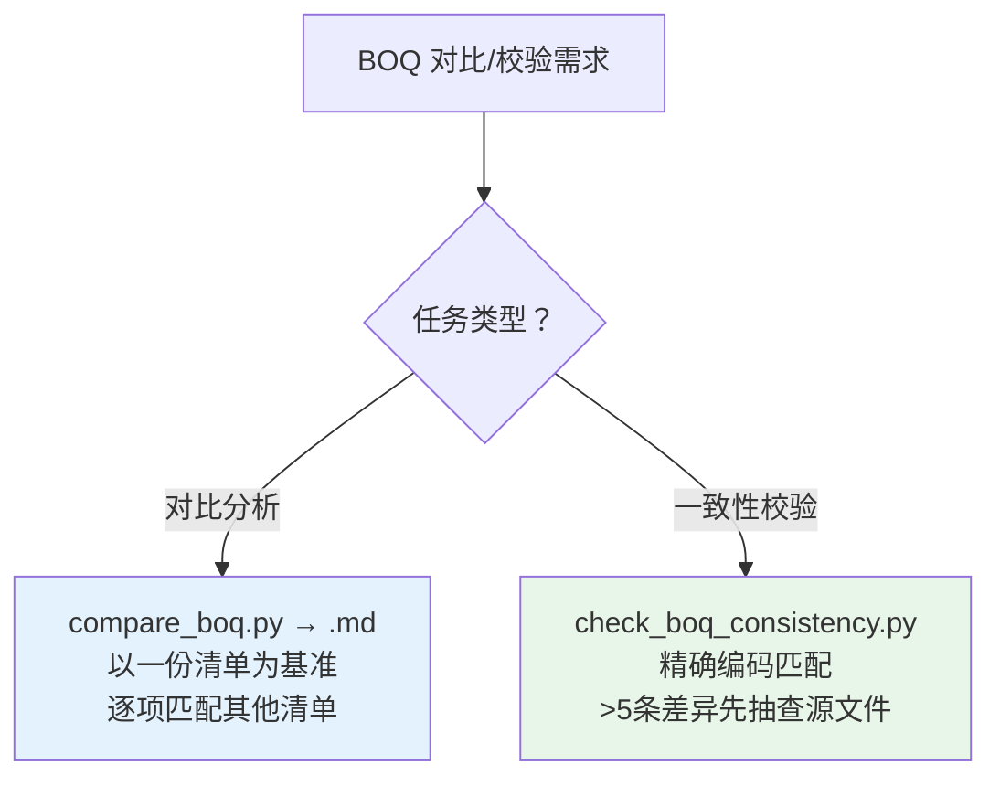

# PK BOQ — 对比检查

> 清单合并/整理 → 触发 `pk-boq-organize` 技能
> 工程造价约定、Excel 兼容性、BOQ 层级体系 → 见 `pk-boq` 技能

## 触发词速查

| 触发词 | 脚本 |
|--------|------|
| 清单对比、BOQ对比、各家对比分析 | `compare_boq.py` |
| 校验清单、一致性检查、BOQ校验、核对工程量、源文件比对 | `check_boq_consistency.py` |

## 决策树



## 脚本速查

> 完整 CLI 参数 → [../pk-boq/references/scripts_reference.md](../pk-boq/references/scripts_reference.md)

| 脚本 | 用途 | 核心要点 |
|------|------|----------|
| `compare_boq.py` | 清单对比分析 | 以一份清单为基准逐项匹配其他清单，三级匹配降级 → .md |
| `check_boq_consistency.py` | 一致性校验 | 精确编码匹配，>5条差异先抽查源文件 |

## 跨切面规则

- **OM/DI 编号**：独立递增贯穿分析 → [../pk-boq/references/boq_conventions.md](../pk-boq/references/boq_conventions.md)
- **输出命名**：`{YYYY-MM-DD}_BOQ_{内容}.{ext}`

## 参考索引

| 文档 | 内容 |
|------|------|
| [../pk-boq/references/scripts_reference.md](../pk-boq/references/scripts_reference.md) | 完整 CLI 参数 |
| [../pk-boq/references/boq_conventions.md](../pk-boq/references/boq_conventions.md) | 工程造价约定（OM/DI编号、DB合同、概算指标） |

---

## compare_boq.py — 清单对比分析

以一份清单为基准，逐项匹配其他类似清单，输出 Markdown 对比报告。

```bash
python compare_boq.py --base <基准> --other <清单2> [--other <清单3> ...] [-o <output.md>] [--project <name>] [--date <YYYY-MM-DD>]
```

| 参数 | 说明 |
|------|------|
| `--base` | 对比基准 BQMerge xlsx |
| `--other` | 其他清单 BQMerge xlsx（可重复指定） |
| `-o, --output` | 输出 .md 路径（默认：`{date}_BOQ_Comparison_Report.md`） |
| `--project` | 项目名称 |
| `--date` | 日期前缀（默认今日） |

**匹配引擎**（三级逐级降级）：精确匹配 → 前缀匹配 → 语义匹配（SequenceMatcher > 0.75）。

---

## check_boq_consistency.py — 清单一致性校验

精确编码匹配验证工程量一致性。**>5 条差异时，先抽查 3-5 条确认不是提取逻辑问题再继续**。

```bash
# JSON 配置模式（推荐，避免中文 sheet 名编码问题）
python check_boq_consistency.py target.xlsx --config mappings.json

# 显式映射模式
python check_boq_consistency.py target.xlsx \
    -m "TargetSheet|source.xlsx|SourceSheet|5" \
    -m "TargetSheet2|source2.xlsx|SourceSheet2|3"

# 自动匹配模式（sheet 名相同时）
python check_boq_consistency.py target.xlsx source.xlsx --qty-col 5
```

| 参数 | 说明 |
|------|------|
| `target` | 待校验的目标 BOQ 文件（必填） |
| `source` | 单个源文件（自动匹配模式） |
| `-m, --map` | 映射规则：`TargetSheet\|source.xlsx\|SourceSheet\|qty_col` |
| `--config` | JSON 配置文件路径（推荐） |
| `--qty-col` | 工程量所在列索引（0-based） |
| `-t, --threshold` | 差异阈值（默认 1.0） |
| `--json` | JSON 格式输出 |

**JSON 配置格式**：
```json
{
  "threshold": 1.0,
  "mappings": [
    {"target_sheet": "E_Quay(OP1) WTCC", "source_file": "wtcc_boq.xlsx", "source_sheet": "E_Quay(OPT. 1)", "qty_col": 5}
  ]
}
```

**qty_col 说明**：WTCC 格式通常工程量在 F 列（0-based = 5），FHDI 格式多在 D 列（0-based = 3）。

## 已知陷阱集

| 陷阱 | 表现 | 解决 |
|------|------|------|
| 父级汇总条目 | 父条目 total 含子项合计 | 标记为父级，不参与验证 |
| 无价格清单 | qty×rate 验证不适用 | 改用条目数+工程量比对 |
| OM/DI 编号不一致 | 同一条目不同文件编号不同 | 以描述文字匹配为主，编号为辅 |
