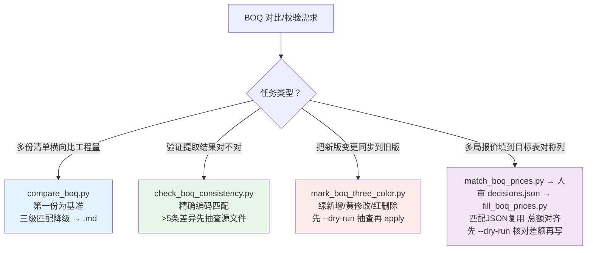

# PK BOQ — 对比检查

> **禁止用 Excel COM 处理表格**（BOQ 技能族硬规则）：不准启动 Excel 来读写、标记、插行、刷新或校验表格，`win32com` 和 COM 版 `excel` MCP 都不行 —— 它会抢占用户正开着的 Excel 实例、逼用户关文件等脚本、还比纯脚本慢。读值用 `fastexcel`，公式文本和保留格式改单元格用 `openpyxl`，插列/插行/搬 sheet/透视表这类结构操作走 zip+XML 层。这是**全局硬规则**（见 `~/.claude/CLAUDE.md` 的「Excel/AI 加速工具集」硬前置），不限 BOQ；BOQ 场景的具体替代做法见 [pk-boq/SKILL.md](../pk-boq/SKILL.md)。


> 清单合并/整理 → 触发 `pk-boq-merge` 技能
> 工程造价约定、Excel 兼容性、BOQ 层级体系 → 见 `pk-boq` 技能

## 脚本位置

五个脚本都在 **`~/.claude/skills/pk-boq/scripts/`**（不在本技能目录下）。调用时写全路径：

```bash
python ~/.claude/skills/pk-boq/scripts/compare_boq.py --help
```

## 选哪个脚本

| 用户要什么 | 脚本 | 产出 |
|-----------|------|------|
| 清单对比、BOQ对比、各家对比分析 | `compare_boq.py` | Markdown 对比报告 |
| 校验清单、一致性检查、核对工程量、源文件比对 | `check_boq_consistency.py` | 差异列表（控制台/JSON） |
| 三色标记、红黄绿、变更应用到旧清单、版本差异更新 | `mark_boq_three_color.py` | 标色后的 xlsx 副本 |
| 套价、单价回填、多局报价填到目标表 | `match_boq_prices.py` + `fill_boq_prices.py` | 匹配 JSON + 人审 decisions.json + 回填后的 xlsx |


```mermaid
flowchart TD
    START["BOQ 对比/校验需求"] --> Q1{"任务类型？"}

    Q1 -->|"多份清单横向比工程量"| B1["compare_boq.py<br/>第一份为基准<br/>三级匹配降级 → .md"]
    Q1 -->|"验证提取结果对不对"| B2["check_boq_consistency.py<br/>精确编码匹配<br/>>5条差异先抽查源文件"]
    Q1 -->|"把新版变更同步到旧版"| B3["mark_boq_three_color.py<br/>绿新增/黄修改/红删除<br/>先 --dry-run 抽查再 apply"]
    Q1 -->|"多局报价填到目标表对称列"| B4["match_boq_prices.py → 人审 decisions.json → fill_boq_prices.py<br/>匹配JSON复用·总额对齐<br/>先 --dry-run 核对差额再写"]

    style B1 fill:#e3f2fd
    style B2 fill:#e8f5e9
    style B3 fill:#fdeaea
    style B4 fill:#f3e5f5
```

`compare_boq` 与 `check_boq_consistency` 的区别：前者比**不同来源**的清单谁多谁少、量差多少，容忍描述措辞不同；后者验证**同一份数据**提取前后是否一致，要求编码精确对上。

`match_boq_prices` 与 `compare_boq` 的区别：两者都是「两个清单找对应」，但 `match_boq_prices` 把匹配结果落成**结构化 JSON**（fill/conflict/multi/none/target_only），既供 `fill_boq_prices` 回填、也供对比分析，避免「对比算一遍、回填又算一遍」。`compare_boq` 的软匹配（desc 相似度）直接出报告，不落中间结果。

## 最小可用命令

完整参数 → [../pk-boq/references/scripts_reference.md](../pk-boq/references/scripts_reference.md)

```bash
S=~/.claude/skills/pk-boq/scripts

# 对比：第一份是基准，份数不限；列位不同的清单单独给列映射
python $S/compare_boq.py --list "A.xlsx|甲方" \
                         --list "B.xlsx|乙方|MergeSheet|code=1,desc=2,unit=3,qty=6" \
                         -o 对比报告.md

# 一致性校验：sheet 名含中文时走 --config
python $S/check_boq_consistency.py target.xlsx --config mappings.json

# 三色标记：先 dry-run 看差异，确认后再写文件
python $S/mark_boq_three_color.py --base old.xlsx --new new.xlsx \
    --base-cols desc=5,unit=6,qty=7 --new-cols desc=3,unit=4,qty=5 --dry-run

# 套价回填：先匹配出结构化 JSON（匹配结果复用），再回填到目标表预留列
python $S/match_boq_prices.py --source 源报价.xlsx --target 目标表.xlsx --out match.json \
    --src-cols item=2,desc=3,unit=4,qty=5 --src-extra rate=7,total=15 \
    --tgt-cols item=2,desc=3,unit=4,qty=5

# 人工审 match.json 的 conflict/multi/none/target_only，裁决写成 decisions.json（放项目目录，勿改脚本）

# 回填：先 --dry-run 核对差额，确认后再去掉 --dry-run 写文件
python $S/fill_boq_prices.py --source 源报价.xlsx --target 目标表.xlsx --match match.json \
    --decisions decisions.json \
    --src-cols item=2,desc=3,unit=4,qty=5,rate=7,labour=8,plant=9,mat=10,sub=11,others=12,offsite=13,headoffice=14,total=15 \
    --tgt-cols qty=17,rate=18,labour=19,plant=20,mat=21,sub=22,others=23,offsite=24,headoffice=25,total=26 \
    --expect-total 17323515.97539893 --dry-run
```

**列号基准**：`compare_boq` / `mark_boq_three_color` / `match_boq_prices` / `fill_boq_prices` 一律 **1-based**（A 列 = 1）；套价两脚本传 <1 的值、列号越界、读不到条目都会直接报错，不会静默读错列。
**唯一例外**：`check_boq_consistency.py` 的 `--qty-col` 和 `--config` 里的 `qty_col` 是 **0-based**（历史沿用，改动会破坏已有 mappings.json）。用它时记得减 1。

## 动手前必做

1. **先 dump 前 100 行确认列位**。各家清单列位不同，且同一来源的新旧版本也会挪列（如工程量列从第 6 列挪到第 5 列）。不要沿用上次的列号，也不要只抽查几行。
2. **路径或 sheet 名含中文时改用 `--config`**（`compare_boq.py` 和 `check_boq_consistency.py` 都支持），避开 Windows 命令行编码问题。
3. **差异条目多时先抽查**：`check_boq_consistency` 报出 >5 条差异，先抽查 3-5 条源文件确认不是提取逻辑的锅；`mark_boq_three_color` 应用前先 `--dry-run`，抽查同描述同 qty 的项有没有被误判成修改。
4. **换项目套价先确认 decisions 归属**。`fill_boq_prices.py` 的 `--decisions` 是项目级文件，新项目第一次跑**不传**（等于无裁决），跑完看 match.json 的人审四类再逐条写。不要拿上个项目的 decisions.json 直接套。

## 套价回填工作流

多局报价填到同一目标表对称列时（如三航 Q~Z、一航 AB~AK），四步走：

1. **匹配**：`match_boq_prices.py` 产出结构化 JSON，`fill`（编号精确+desc 归一化命中的自动配对）可直接回填；`conflict`/`multi`/`none` 是人审区，`target_only` 是目标独有项。
2. **人审**：读 `conflict`（同编号 desc 不符）/`multi`（一源对多目标）/`none`（源无对应），把裁决写成 **`decisions.json`**（键见 [scripts_reference](../pk-boq/references/scripts_reference.md)：`manual_fill`/`green_fill`/`green_insert`/`insert_desc`/`item0_desc`/`skip_src`/`special`），存到目标表同目录，命名带来源如 `decisions_三航局.json`。
3. **回填**：`fill_boq_prices.py` 消费同一份 match.json + decisions.json，把源价格写到目标预留列。
4. **总额对齐**：`--expect-total` 传目标列期望总额，差额在容差内才写盘。

**裁决表跟项目走，不写进脚本**。裁决绑定具体项目的编号体系——`("H.1.9.11.2","H.1.10.2")` 这类偏移配对在别的 BOQ 里同样可能两头都存在，硬编码进共享脚本会把毫不相干的两项强行配上，且只填一次不触发重复行检测。decisions.json 里写 `"_target": "目标表文件名.xlsx"`，跑错项目时会告警。

**核心：匹配结果只算一次**。`match_boq_prices.py` 产出的 JSON 是单一事实源——回填用它的 `fill`，对比报告用它的 `conflict`/`multi`/`none`/`target_only` 分析谁多谁少。换一个局回填时（三航→一航），编号体系一致则**直接复用同一份 match.json**，不用重新匹配。

**多局对称列**：同一目标表留多个来源局的列区（如三航 Q~Z 列 17~26，一航 AB~AK 列 28~37，间隔 +11），`fill_boq_prices.py` 用 `--tgt-cols` 指定写到哪一区。后续局复用首次局的插入行，语义会从「插入新行」漂移成「填已存在行」（见陷阱表「插入→填充语义漂移」）。每个局一份自己的 decisions.json。

## 硬规则

**三色标记**：删除项只标红不删（等人工确认）；名称同义仅翻译差异的不改；原背景色保留。

**插行不启动 Excel。** `mark_boq_three_color.py` 走 `xlsx_rowops.SheetEditor`（zip/XML 层），插入行之后的公式行引用由它统一平移 —— 包括绝对引用（`$U$44` → `$U$45`）和汇总范围（`SUBTOTAL(9,N5:N43)` → `N5:N44`）。行号一律按**原表**给，偏移内部算，不需要从后往前插。

**对比报告**：输出命名 `{YYYY-MM-DD}_BOQ_{内容}.{ext}`；报告与被对比的源文件放同一目录。

## 已知陷阱

| 陷阱 | 表现 | 解决 |
|------|------|------|
| 父级汇总条目 | 父条目 total 含子项合计，重复计入 | 标记为父级，不参与验证 |
| 无价格清单 | qty×rate 验证不适用 | 改用条目数 + 工程量比对 |
| OM/DI 编号不一致 | 同一条目在不同文件里编号不同 | 以描述文字匹配为主，编号为辅 |
| 编码列填说明词 | `ADD`、`RunWay` 等填在编码列，被误当分组 | `compare_boq.py` 已按层级符号识别分组规避；自己写脚本时注意 |
| 同编码重复出现 | 不同小节下重复编号（如两个 B.2.1） | 匹配按「分组+小节」分桶，勿全表按编码匹配 |
| 重复编号（插入行 vs 原行） | 插入的新行与原行共享编号，`item_row` dict 覆盖漏判 | 按 `(item, desc)` 建索引，用 `insert_desc` 消歧定位 |
| 叶子判定漏判 | 插入行只填部分列（trueqty 空），被判非叶子 | `is_leaf` 放宽到「trueqty 或预留 qty 列有数」 |
| 插入→填充语义漂移 | `green_insert` 首局插入新行，后续局复用已存在行 | 后续局改「填已存在行」，勿再插入 |
| fill 错误映射 | desc 降级误匹配（H.2.5.15.15→H.2.5.16.16） | `skip_src` 跳过 + `special` 显式定位 |
| dry-run 与写回不一致 | 重复行 double-count，dry-run 差额 0 写回后差额非 0 | 写盘前检测重复行号，命中即终止 |
| 裁决表张冠李戴 | 别项目的 decisions 里编号在本项目同样存在，被强行配对 | decisions 写 `_target` 绑定；跑错会告警 + 落空告警 + 差额闸门 |
| 浮点累加噪音 | 上万条 float 相加差 1e-8，被当成真实差异 | 差额按容差 `max(0.01, 期望×1e-9)` 判定，勿要求严格等于 0 |

## 参考索引

| 文档 | 内容 |
|------|------|
| [../pk-boq/references/scripts_reference.md](../pk-boq/references/scripts_reference.md) | 五个脚本的完整 CLI 参数、decisions.json 结构、匹配引擎细节 |
| [../pk-boq/references/boq_conventions.md](../pk-boq/references/boq_conventions.md) | 工程造价约定（OM/DI编号、DB合同、概算指标） |
| [../pk-boq/references/three_color_diff.md](../pk-boq/references/three_color_diff.md) | 三色差异标记方法论（判定规则、匹配引擎、插入策略、陷阱） |
