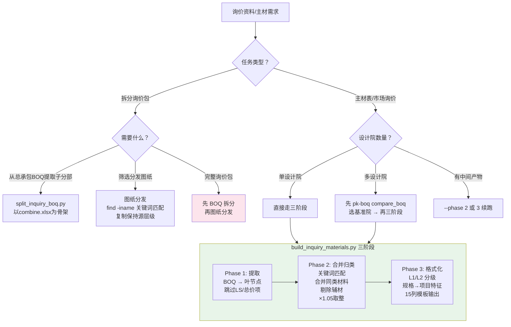

# PK BOQ — 询价包与主材表

> 清单合并/对比/校验等核心操作 → 触发 `pk-boq` 技能
> 工程造价约定、Excel 兼容性、BOQ 层级体系 → 见 `pk-boq` 技能

## 触发词速查

| 触发词 | 对应 |
|--------|------|
| 拆分询价表、制作询价清单、分包询价清单、提取BOQ子分部 | `split_inquiry_boq.py` |
| 分发图纸、准备询价资料、询价包目录 | 图纸分发（手工流程） |
| 主材表、材料清单、材料汇总、市场询价表、合并主材 | `build_inquiry_materials.py` |

## 决策树



## split_inquiry_boq.py — BOQ 清单拆分

从总承包 BOQ 提取子分部，以基础模板为骨架组装独立询价清单。

```bash
python ../pk-boq/scripts/split_inquiry_boq.py \
    --template "combine.xlsx" \
    --source "WTCC.xlsx" --label WTCC \
    --source "FHDI.xlsx" --label FHDI --fix-ref "1" \
    --match "E_Quay" \
    --output "output.xlsx"
```

关键规则：以模板为骨架、完整复制列结构、Section（如 E.2）为最小保留单元、多方案都保留。

详细工作流 → [../pk-boq/references/inquiry_package_boq.md](../pk-boq/references/inquiry_package_boq.md)

## 图纸分发

按文件名关键词匹配分发图纸到标准化目录结构，不打开文件读取内容。

```bash
# 搜索示例
find <源目录> -iname "*关键词*"
```

核心规则：
- 用 `find -iname` 搜索（不用 MCP search），双语关键词并行
- 编号文件先查图纸索引再选图，无直接匹配选结构图或总图
- 每次分发前检查参考包的完整目录结构
- 复制保持源层级，不扁平化

标准目录结构：`{包编号} {包名称}/ → 1.BQ/ 2.Employer's documents/ 3.Tender Design/ 4.PER/ 5.Site surveys/`

详细工作流 → [../pk-boq/references/inquiry_package_splitting.md](../pk-boq/references/inquiry_package_splitting.md)

## build_inquiry_materials.py — 主材表/市场询价表

三阶段流水线，从设计院 BOQ 到分级市场询价表：

```bash
python ../pk-boq/scripts/build_inquiry_materials.py \
    --source <BOQ.xlsx> --config <config.json> \
    --template <模板.xlsx> -o <输出目录>
```

可 `--phase 1/2/3` 分阶段续跑。Phase 1 输出 `items.json`，Phase 2 输出 `consolidated.json`，Phase 3 输出最终 .xlsx + .md。

配置文件格式和归类规则 → [../pk-boq/references/consolidation_rules.md](../pk-boq/references/consolidation_rules.md)
完整工作流 → [../pk-boq/references/material_inquiry_workflow.md](../pk-boq/references/material_inquiry_workflow.md)

## 参考索引

| 文档 | 内容 |
|------|------|
| [../pk-boq/references/inquiry_package_boq.md](../pk-boq/references/inquiry_package_boq.md) | BOQ 清单拆分完整工作流 |
| [../pk-boq/references/inquiry_package_splitting.md](../pk-boq/references/inquiry_package_splitting.md) | 图纸分发完整工作流 |
| [../pk-boq/references/consolidation_rules.md](../pk-boq/references/consolidation_rules.md) | 主材归类规则编写指南 |
| [../pk-boq/references/material_inquiry_workflow.md](../pk-boq/references/material_inquiry_workflow.md) | 主材表提炼完整工作流 |
| [../pk-boq/references/scripts_reference.md](../pk-boq/references/scripts_reference.md) | 完整 CLI 参数参考 |
