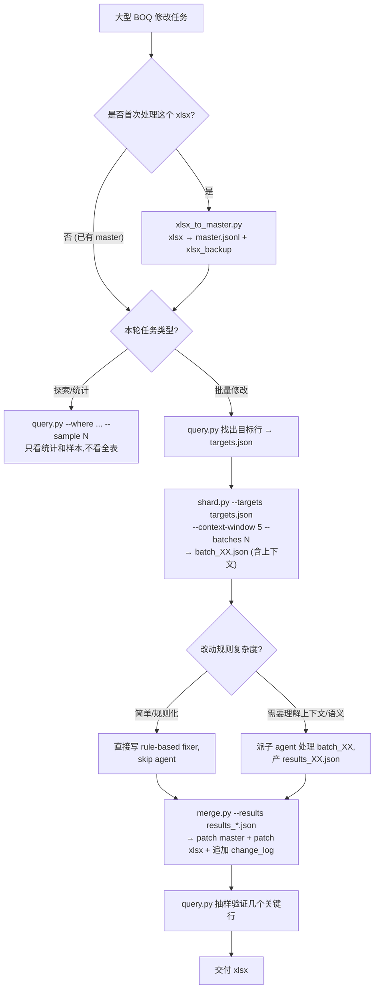

# PK BOQ — JSON 主状态 + 分片工作流

> 适用场景：单张 xlsx 表 ≥ 5000 行、需要多轮/多批增量修改的 BOQ 清单类文件（分类、校准、扩列、批注、翻译等）。
> 反面场景：一次性小改动、纯读取分析 → 直接 xlsx/fastexcel 就够，不要过度设计。

## 核心心法（必读）

**master 永远躺在磁盘,不进 Claude 上下文**。任何时候需要"知道要改哪些行、怎么分片、当前状态如何",都是**跑脚本**去查,Claude 只看脚本输出。

对比传统做法:
| 操作 | 传统 (每次 fastexcel 读全表) | 本 workflow (脚本查 master) |
|------|-----------------------------|----------------------------|
| 找嫌疑行 | 读 20K 行进上下文再过滤 | query.py 命令行 WHERE,只吐匹配行摘要 |
| 分片派 agent | 手写切片逻辑,反复调 | shard.py --targets ... --batches N |
| 合并回写 | 手写 apply 脚本 | merge.py 统一 patch master + xlsx |
| 多轮迭代 | 每轮重新读 xlsx | 每轮基于 master JSONL 增量 |

## 决策树



## 触发词速查

| 触发词 | 对应动作 |
|--------|----------|
| 建立 master、导入 xlsx | `xlsx_to_master.py` |
| 找哪些行、统计、样本、抽查 | `query.py` |
| 分片、拆 batch、派 agent | `shard.py` |
| 合并结果、应用修改、写回 xlsx | `merge.py` |
| 换 xlsx 骨架、重新导出 | `master_to_xlsx.py` |
| 回滚、查改动历史 | 看 `change_log.jsonl` |

## 标准工作流

### 阶段 1: 首次导入（每个 xlsx 只做一次）

```bash
python scripts/xlsx_to_master.py \
    --xlsx "path/to/BQ_project.xlsx" \
    --sheet "ZOO BQ" \
    --header-row 1 \
    --output-dir "temp/boq_workflow"
```

产物:
- `temp/boq_workflow/master.jsonl` — 每行一条 record,含 excel_row / project / chapter / subheading / desc / unit / qty / rate / current_disc / current_cat / ...
- `temp/boq_workflow/xlsx_backup.xlsx` — 原文件的样式骨架（用于最终导出）
- `temp/boq_workflow/schema.json` — 列映射、chapter 前缀等元数据
- `temp/boq_workflow/change_log.jsonl` — 空文件,后续所有修改追加于此

### 阶段 2: 查询/探索（不进 Claude 上下文）

```bash
# 找具体行
python scripts/query.py --master master.jsonl --rows 12103,14369 --format table

# WHERE 过滤 + 只吐样本
python scripts/query.py --master master.jsonl \
    --where "desc contains 'Morning Glory'" --sample 5

# 按当前分类统计
python scripts/query.py --master master.jsonl \
    --group-by discipline,category --show-counts

# 找嫌疑行(内置常见 pattern)
python scripts/query.py --master master.jsonl \
    --preset plant_in_non_landscape,pipe_insul_in_arch --output targets.json
```

Claude 只看 stdout 的表格/统计/样本,几 KB 而已。

### 阶段 3: 分片（准备派 agent）

```bash
python scripts/shard.py \
    --master master.jsonl \
    --targets targets.json \
    --context-window 5 \
    --batches 6 \
    --output-dir temp/boq_workflow/batches_v7
```

产物:
- `batches_v7/batch_01.json` .. `batch_06.json` — 每个含 ~100-200 items,每个 item 带 5 行 PrevContext + 3 行 NextContext + 当前 chapter/subheading
- `batches_v7/SUBAGENT_INSTRUCTIONS.md` — 从 template 复制过来,可编辑

### 阶段 4: 处理（agent 或规则）

**Agent 路径** (语义判断):
```
派 6 个并行 sub-agent,每个读一份 batch_XX.json + INSTRUCTIONS,
写 results_XX.json (同顺序,ExcelRow 保留)
```

**规则路径** (确定性):
```
直接写 apply_batch.py 遍历 batch,输出 results_XX.json
```

两条路径产物一致 — `results_XX.json`,agent 和规则可以混用（部分行 agent 处理,其余规则批处理）。

### 阶段 5: 合并回写

```bash
python scripts/merge.py \
    --master master.jsonl \
    --results temp/boq_workflow/batches_v7/results_*.json \
    --xlsx-out "path/to/BQ_project_v7.xlsx" \
    --reason "v7: fix pre-existing plant/insulation misclassifications"
```

做的事:
1. 合并所有 results_*.json 成一份 patch
2. 更新 master.jsonl 中对应行
3. 追加到 change_log.jsonl（每行 field 的 old/new/reason/timestamp）
4. 复制 xlsx_backup 到新路径,只覆盖被 patch 的单元格,保留全部样式/公式/合并单元格

### 阶段 6: 验证

```bash
python scripts/query.py --master master.jsonl \
    --rows 12103,14369,15668,19781 --format table
```

抽查关键行改成什么了。同时看 change_log.jsonl 尾部几条,确认 patch 记录完整。

## 详细文档

| 文档 | 内容 |
|------|------|
| [references/master_schema.md](references/master_schema.md) | master.jsonl 每行的字段定义、列映射、chapter 前缀规则 |
| [references/query_recipes.md](references/query_recipes.md) | query.py 常用 preset 和自定义 WHERE 写法 |
| [references/shard_dispatch.md](references/shard_dispatch.md) | 分片策略、上下文窗口选择、agent vs 规则决策 |
| [references/merge_and_xlsx.md](references/merge_and_xlsx.md) | merge.py 的 xlsx 骨架保留策略、样式冲突处理、change_log 结构 |
| [references/subagent_template.md](references/subagent_template.md) | 派子 agent 的标准 prompt 模板（分类校准场景） |

## 与其他 pk-boq 技能的关系

- 数据流:BOQ 源文件 → [pk-boq-organize] 归一化 → **本技能** → 后续 [pk-boq-compare / inquiry / price-match / quotation]
- 大型清单被反复调整分类/扩列/翻译时启用本技能;单次小改直接用其他技能自己的脚本

## 不适用场景

- 行数 < 5000 且改动一次到位 → 用 fastexcel + openpyxl 直接改就好
- 只要合并/对比/单价套价这类**特定业务** → 用对应 pk-boq-* 子技能
- 需要跨 5+ 项目横向查询 → 升级到 SQLite 方案（本 workflow 是 SQLite 的轻量前身,master JSONL 可以一句 SQL 导入 SQLite）
