# BOQ 合并工作流拓扑

```mermaid
flowchart LR
    SRC["源 xlsx"] --> ROUTE{"需求"}

    ROUTE -->|"合并"| P0["0.临时副本"]
    ROUTE -->|"清链接"| C1["探测"]

    C1 --> C2["7步清理"] --> C3["6项验证"] --> P0

    P0 --> P05["0.5 清单表识别"]
    P05 --> P06["0.6 隐藏行检测"]
    P06 --> STY["0.7 读样式表"]
    STY --> P1["1.读值+带样式堆叠"]
    P1 --> P2["2.去重"]
    P2 --> P3["3.L1标记注入"]
    P3 --> P4["4.自检验证"]
    P4 --> OUT_M["Merge xlsx（标注色保留）"]
    OUT_M --> HIER["pk-boq-hierarchy 技能"]
    HIER --> OUT_F["标准化 BOQ（五级层级）"]
```



## 阶段详解

值和样式分头读、合并写：**值走 fastexcel**（快 9-16x），**样式走 openpyxl read_only**（20000 格 0.24 秒），**输出走 xlsxwriter + Format 缓存池**。

| 阶段 | 输入 | 做什么 | 输出 |
|------|------|--------|------|
| Phase 0 临时副本 | 源 xlsx | `shutil.copy2` 到 `temp/_merge_temp_{name}.xlsx`，之后所有操作在副本上进行 | 临时副本路径 |
| Phase 0.5 清单表识别 | 临时副本 | `identify_qualifying`：关键字筛 sheet → 确认描述+单位+工程量列 → 取最宽表为表头模板 | 合格 sheet 列表 + 表头元信息 |
| Phase 0.6 隐藏行检测 | 临时副本 + 合格 sheet | openpyxl 检测隐藏行，如有则询问用户是否删除（`--delete-hidden-rows`）。删除后行号全部上移，**必须重跑 Phase 0.5** | 清理后的临时副本 |
| Phase 0.7 读样式 | 临时副本 + 合格 sheet | `read_cell_styles`：openpyxl read_only 遍历，把每格的 (底色, 字体色, 粗, 斜) 收成 `{(行,列): key}`，纯默认样式的格不记 | 样式表（稀疏字典） |
| Phase 1 带样式堆叠 | 临时副本 + 样式表 | 三趟：读值+取样式 → 描述列前向填充 → 过滤垃圾行。值和样式共用同一个 `col_map` | 各 sheet 的 (值, 样式) 行对 |
| Phase 2 去重 | 行数据 | 跳空行/错误值/重复表头/CARRIED FORWARD/页码，其余全部保留 | 清洗后数据 |
| Phase 3 L1标记 | 清洗后数据 | 每个 sheet 数据前插入 L1【sheet名】行 | 合并后数据 |
| Phase 4 自检验证 | 输出 xlsx | fastexcel 重读交付文件，按 L1 分段求工程量和，与源侧逐段比对 + 总计比对 | `(日期 Merge)原文件名.xlsx` |
| Phase 5 NRM层级化 | Merge xlsx | **路由到 `pk-boq-hierarchy` 技能**（含 AI 审查 + 仲裁 + 修正回写） | 五级层级化 xlsx |

## 样式保留机制

原清单的底色是人工信息——标黄待确认、标红异常、章节配色。旧版只读值不读样式，这些标注在合并后全部归零。

`make_fmt_pool` 返回一个工厂函数，按 `(底色, 字体色, 粗体, 斜体, 是否数字)` 缓存 xlsxwriter Format 对象：

```
无标注的格  → 复用同一个默认 Format
标黄的格    → 复用"黄底"Format
标红的格    → 复用"红底"Format
```

真实 BOQ 里不同样式组合就几十种，所以 Format 对象总数是常数级，30000 行只多出几十个对象。**逐格 `add_format` 是禁止的**——Format 对象会逐个写进 styles.xml，文件体积和写入耗时都会爆。

保留：底色、字体色、加粗、斜体（含空单元格上的底色）。
不保留：字体名/字号（统一 9pt Microsoft YaHei UI）、边框、行高——这三项下游 hierarchy 按层级重设。

## 行号对齐（关键约束）

样式表用 `{(行索引, 列索引): key}` 索引，行索引必须和 fastexcel 的 DataFrame 索引严格一致，否则整表颜色串行。

`load_sheet_by_name()` 的 `header_row` 默认是 `0`，会吃掉第一行当列名，使 df 索引比真实行号少 1。因此本脚本**所有** fastexcel 读取都显式传 `header_row=None`，让 df 索引 = Excel 行号 - 1，与 openpyxl `iter_rows()` 的 enumerate 对齐。

## 为什么不用 Excel COM

评估过 `win32com` 的 `Range.Copy(Destination)` 整体复制，格式 100% 保真（连边框和合并单元格都带），但实测更慢：

| 规模 | 现方案（xlsxwriter + 样式池） | COM 整体复制 |
|------|------------------------------|--------------|
| 7500 行 | **5.5 秒** | 13.6 秒 |

COM 有约 8 秒固定启动开销，边际成本虽低但交叉点在 2-3 万行以上；此外还要依赖本机装 Excel、`Quit()` 异步可能残留 excel.exe 进程占几百 MB。脚本逐格写不是 token 生成，几秒钟的事，不值得引入进程依赖。**不要再往 COM 方向改。**

## 列对齐（按表头名称）

窄表缺 Specifications 列时，不能按列号硬编码位移——曾假定 Quantity 在 index 3，而真实列序是 Ref(0)/Description(1)/描述(2)/Unit(3)/Quantity(4)，导致窄表整列错位；更隐蔽的是源侧工程量和也在映射后才计算，两侧同错对消，验证假通过。

现在：以最宽 sheet 的表头为模板，逐列按表头文本匹配模板列位置；未匹配上的列（空表头或改名）保持原位。工程量校验从**源列直读**，绕开映射，这样映射一旦出错验证必然报 FAIL。

由于整体复制无法在一个块内位移列，列映射按"src→dst 偏移相同"切成连续段，每段一次 `Copy`。表头名称完全一致时只有一段。

## 清除外部链接（合并前置）

```
源 xlsx → 探测确认 → 7步 ZIP/XML 清理 → 6项验证 → 干净 xlsx → 进入合并流水线
```

> 始终从原始文件一次性清理，增量清理会掩盖问题。

## 临时副本机制

- 合并开始时 `shutil.copy2` 源文件到 `temp/` 子目录
- 所有读写操作（清链接、隐藏行检测/删除、fastexcel 读值）均针对临时副本
- 合并完成后 `finally` 块自动清理临时副本
- 如遇隐藏行需用户确认，临时副本保留在 `temp/` 供检查

## 清单表识别

`classify_sheet` 对每个候选 sheet 判类型，两类都纳入合并：

```
描述列 AND 单位列 AND 工程量列        → "measured"  分部分项工程量清单
描述列 AND 金额列（无单位/工程量）    → "lumpsum"   开办费、暂列金、暂定金额、计日工
两者都不满足                          → 跳过
```

**判定顺序**：先 measured 再 lumpsum。分部分项表通常也带金额列，若顺序颠倒会被误判为总价项，进而丢掉工程量校验。

**金额列同义词组**（`AMOUNT_ALIASES`）：`Amount / Total / Total Price / Total Amount / Total Cost / Sum / Price / Amt / 金额 / 合价 / 总价 / 总额`。`build_col_map` 第二趟用这个组匹配，让开办费的 `Amount` 落到模板的 `Total Price` 列。注意 `Unit Rate` **不在**组内——单价不是合价。

## 汇总表为什么只能靠名字拦

放宽到"描述+金额"之后，汇总表和 lumpsum 表在结构上**完全不可区分**：

| | 开办费表 | 汇总表 |
|---|---|---|
| 列 | Ref / Description / Amount | Ref / Description / Amount |
| 行 | 站区建设、临时办公室… | SCHEDULE 1、SCHEDULE 2… |

唯一区别是描述列的内容语义（引用其他 sheet 名），做成自动判定既不稳又会误伤。所以防线只有 `DEFAULT_SKIP_PATTERNS`：

```
SUMMARY / LIST / COLLECTION / GRAND TOTAL / 汇总 / 总计
```

误纳一张汇总表 = 全标造价凭空翻倍，且**校验查不出来**（源侧输出侧都算了这张表，两边一致）。遇到新命名（`BILL NO.1`、`RECAP`、`ABSTRACT`）必须用 `--skip` 补上。用 `GRAND TOTAL` 而不是 `GRAND` 是为了不误伤 `GRANDSTAND`（看台）这类真实构筑物。

## 副表头 vs 第一条数据行

表头下一行的归属是个真实陷阱，三种东西都可能出现在那个位置：

| 那一行是 | 特征 | 该怎么处理 |
|---|---|---|
| 真副表头 | THB/Baht 货币行、(1)(2)(3) 列编号行；描述列空或极短 | 并入表头块 |
| 章节标题 | 只占描述列一格 | 留在数据区 |
| 第一条数据 | 描述列长文本 + Ref 列条目编号 | 留在数据区 |

判定要求全部满足才算副表头：**跨 2 列以上**（排除章节标题）、**无 BOQ 关键词**、**描述列 ≤ 6 字**且 **Ref 列不匹配 `^[A-Za-z]?\d+(\.\d+)*[a-z]?$`**（排除数据行）。

分部分项表一般有章节标题挡在表头下面，所以这个 bug 长期没暴露；开办费表表头下面直接是数据，一判错就整条吞掉——实测中 SCHEDULE 1 和 SCHEDULE 5 各丢了第一条。

## 校验为什么要核两个量

工程量和金额都要核，且**源侧必须从各表自己的列直读原始行**：

- 只核工程量 → 开办费表恒为 0.00 vs 0.00，等于没核
- 源侧读映射后的 `row_data` → 列映射出错时两侧同错对消，验证假通过

源侧走 `s_unit_col / s_qty_col / s_amount_col`（该 sheet 自己的列索引 + 未映射的 `src_vals`），输出侧重读交付文件按 L1 分段求和。两条路径独立，映射错了必然报 FAIL。