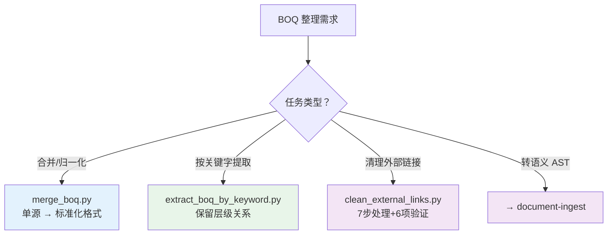

# PK BOQ — 整理

> **清除外部链接** → 优先触发 `xlsx-clean-external-links` 技能（独立入口，精准匹配）
> 清单对比/校验 → 触发 `pk-boq-compare` 技能
> 询价包拆分/主材表 → `pk-boq-inquiry`
> 报价提取 → `pk-boq-quotation`
> 工程造价约定、Excel 兼容性、BOQ 层级体系 → 见 `pk-boq` 技能

## 触发词速查

| 触发词 | 脚本 |
|--------|------|
| 合并清单、BOQ合并、归一化、标准化清单 | `merge_boq.py` |
| 关键字提取、按关键词拆分、筛选特定条目 | `extract_boq_by_keyword.py` |
| 清理外部链接、清理Excel表、清理Excel文件、干净xlsx、剥离链接、去除外部引用 | `clean_external_links.py` |
| Excel-AST、转AST、结构化清单、清单语义分析 | 加载 `document-ingest` 技能 |

## 决策树



## 脚本速查

> 完整 CLI 参数 → [../pk-boq/references/scripts_reference.md](../pk-boq/references/scripts_reference.md)

| 脚本 | 用途 | 核心要点 |
|------|------|----------|
| `merge_boq.py` | 单源清单标准化 | 4 级层级识别，xlsxwriter 输出，最左列插入序号 |
| `extract_boq_by_keyword.py` | 关键字提取子清单 | 保留层级关系，模板样式输出 |
| `clean_external_links.py` | ZIP/XML 级清理外部链接 | 7 步处理：4 层清理 + shared formula 修复 + calcChain 同步，6 项强制验证 |

## 跨切面规则

- **BOQ 层级**：`L1【】→ L2《》→ L3{}→ L4 条目` → [../pk-boq/references/boq_hierarchy_rules.md](../pk-boq/references/boq_hierarchy_rules.md)
- **Excel 兼容性**：优先 xlsxwriter 新建 → [../pk-boq/references/excel_compatibility.md](../pk-boq/references/excel_compatibility.md)
- **输出命名**：`{YYYY-MM-DD}_BOQ_{内容}.{ext}`

## 参考索引

| 文档 | 内容 |
|------|------|
| [../pk-boq/references/scripts_reference.md](../pk-boq/references/scripts_reference.md) | 完整 CLI 参数 |
| [../pk-boq/references/boq_hierarchy_rules.md](../pk-boq/references/boq_hierarchy_rules.md) | 四级层级、样式、行分组 |
| [../pk-boq/references/excel_compatibility.md](../pk-boq/references/excel_compatibility.md) | Excel 兼容性规范 |

## 跨技能引用

| 技能 | 用途 |
|------|------|
| `document-ingest` | Excel 结构探测、列自动检测 |
| `xlsx` | 底层 Excel 读写、公式重算 |
| `translation-agent` | 清单中英文双向翻译 |
| `thinking-in-files` | 复杂多步骤推理时打草稿 |

---

## BOQ 合并标准工作流（四阶段）

### Phase 1: 结构探测 + 列映射

**不要假设所有 sheet 列布局相同。每个 sheet 必须独立探测。**

```bash
# 先看工作簿全貌
python excel_to_ast.py "source.xlsx" --mode workbook_summary

# 每个目标 sheet 转 AST（前 50 行即可看清表头）
python excel_to_ast.py "source.xlsx" --mode sheet_ast --sheet "Sheet1" --max-rows 50 -o ast.json
```

阅读 AST 逐 sheet 确认：表头行号、数据起始行、Item/描述/单位/数量列、单价和合价的真实列位置。

**Unit Rate 陷阱**：表头"Unit Rate"列后常跟分解区（Labour/Plant/Material/Subcontractor），真正汇总单价在分解区之后。必须用数据验证法定位列：

```python
# 读前几条有数值的行，验证 qty × rate = total，确认 rate_col 和 total_col
for r in range(10, 50):
    for rate_c, total_c in candidate_pairs:
        if abs(float(qty) * float(rate) - float(total)) < 0.02:
            # 找到了
```

验证至少 3 个不同数据行确认列组合稳定。最终用硬编码 per-sheet 列映射（`SHEET_COLS` 字典）。

### Phase 2: 执行合并

在 Phase 1 确认列映射后执行合并：

- 表头搜索范围：`range(1, 50)`
- 数据起始搜索：表头行后逐行找第一条有效数据
- 空行连续 >50 行作为终止条件
- 4 级层级：`【sheet名】→《一级分组》→{二级分组}→条目`
- 输出格式：xlsxwriter，行分组折叠，数字会计格式 `#,##0.00`
- **最左列（A 列）插入序号列**：从 1 开始逐行递增，标记每条清单项目的序号。父级层级行和汇总行不计入序号。

### Phase 3: 噪声过滤（最小化原则）

**先合并再清噪**，所有数据在同一表中统一清理，避免每源重复操作且降低误删风险。

**核心原则：仅跳过明显噪声，不确定时一律保留。** 过度过滤导致信息丢失是更严重的错误。

**必跳（白名单，仅以下类型）**：

| 噪声类型 | 识别方式 | 处理 |
|----------|---------|------|
| 空行 | item 和 desc 均为空 | 跳过 |
| 汇总行 | `TOTAL` / `SUBTOTAL` / `% Cost` | 跳过 |
| 扉页/前言 | 含 `The Bill of Quantities` | 跳过 |
| 重复表头行 | `CLASS X` 标识行 | 跳过 |
| Excel 错误值 | `#REF!` / `#VALUE!` / `#N/A` 等 | 跳过 |
| 中文表头翻译行 | 单元格值 = `序号`/`项描述`/`单位`/`数量`/`单价`/`合价` | 跳过 |

**必留（不得过滤）**：

| 类型 | 示例 | 原因 |
|------|------|------|
| 无 Item 编号但有实质内容的说明行 | `Contractor to itemise...` | 属于 BOQ 正文内容 |
| BOQ 条款/指示文字 | `The Tenderer shall separately list...` | 合同要求信息 |
| 工程量备注 | `Quantities left blank` / `All quantities stated` | 计量说明 |
| 承包商设计说明 | `the Contractor's design` | 技术方案信息 |
| 任何有实际信息的行 | — | 不确定时一律保留 |

> **Design Qty 回退规则**：优先取 Design Quantity；如为空而 Tender Quantity 有值，则取 Tender Quantity。

### Phase 4: 自检验证（强制）

合并完成后**必须**自检，不得直接交付。

**核心验证：清单条目数量和工程量一致性**

对于每一条有描述、名称、单位、工程量的清单项目（非父级层级行、非汇总行）：

1. **条目数量一致**：合并后清单中符合条件的条目数 = 源文件中对应条目数
2. **工程量一一对应**：逐条比对各条目在合并文件和源文件中的工程量值，必须完全一致（允许 0.5% 浮点误差）
3. **描述/名称/单位一致性**：抽查条目确保描述、名称、单位列值与源文件一致

```python
# 验证逻辑：遍历合并文件的条目，逐条与源文件对应条目比对
# qty 差异 < 0.5% 视为一致
```

**检查清单**：
- [ ] 所有目标 sheet 均已提取（无遗漏）
- [ ] 条目数与源文件一致（每个 sheet 逐一核对）
- [ ] 逐条工程量与源文件一一对应（差异 < 0.5%）
- [ ] 每个 sheet 随机抽 3 条核对描述/名称/单位
- [ ] 序号列连续无跳号（只计数据行，不计层级行和汇总行）
- [ ] 层级分组可折叠、配色正确

**只有全部通过后才能交付。**

---

## 清除外部链接工作流

**触发条件**：用户要求清除 Excel 外部链接、去除外部引用、剥离链接、清理 xlsx 外部连接，或 Excel 打开时弹出"更新链接"提示导致卡死/长时间等待。

### 核心原理

Excel `.xlsx` 文件本质是 ZIP 包，内部包含多个 XML 文件。外部链接分布在 4 个层面：

1. `xl/externalLinks/` — 外部链接数据文件（含 `_rels/`）
2. `xl/workbook.xml` — `<definedName>` 含外部引用 + `<externalReferences>` 元素
3. `xl/*.rels` — Relationship 文件中的 externalLink 类型引用
4. `xl/worksheets/sheetN.xml` — 单元格公式中的 `[N]` 外部引用标记

**清理时必须同时处理以上 4 层 + 维护两处一致性**，遗漏任何一处都会导致 Excel 报错或崩溃。

### calcChain 一致性（最关键）

Excel 的 `xl/calcChain.xml` 记录所有公式单元格的计算顺序。**删除公式而不删除对应 calcChain 条目，会导致 Excel 陷入修复 → 崩溃的无限循环**（比"更新链接"提示严重得多，文件完全无法使用）。

```
calcChain: <c r="A1" i="1"/>  →  必须有对应的 sheet 单元格 <c r="A1"><f>...</f></c>
```

脚本 Step 4 负责清理 calcChain，但前提是前面步骤正确标记了所有被转值的单元格（`sheet_cells_converted` 集合）。

### shared formula 机制

Excel 用 shared formula 优化重复公式存储：
- **Master**：`<f t="shared" ref="A1:A10" si="0">=A1*2</f>` — 包含公式文本 + 范围
- **Slave**：`<f t="shared" si="0"/>` — 自闭合，引用 master 的公式

清理外部链接时：
- 如果 master 被转值，整个 si 组的所有 slave 都会变成**孤立公式**（无 master 可引用）
- 孤立公式 = calcChain 有记录但公式已损坏 = Excel 修复循环崩溃
- **Step 2b 专门处理这种情况**：检测孤立 shared formula 并全部转值，同时标记给 calcChain 清理

### Phase 1: 探测确认

先确认文件确实存在外部链接，量化清理范围。**必须使用原始文件，不能使用之前已部分清理过的文件**（增量清理会掩盖问题，应从原始文件一次性完成）：

```bash
python -c "
import zipfile, os, re
f = 'path/to/file.xlsx'
with zipfile.ZipFile(f, 'r') as z:
    names = z.namelist()
    ext = [n for n in names if 'externalLinks' in n]
    wb = z.read('xl/workbook.xml').decode('utf-8', errors='replace')
    has_ext_refs = '<externalReferences' in wb
    bad_dn = len(re.findall(r'<definedName[^>]*>.*?\[.*?</definedName>', wb, re.DOTALL))
    print(f'{os.path.basename(f)}: {len(ext)} external links, extRefs={has_ext_refs}, bad DN={bad_dn}')
"
```

### Phase 2: 执行清理

**必须使用技能内置脚本** `scripts/clean_external_links.py`，不得编写 ad-hoc 临时脚本。内置脚本处理全部 4 层 + 两项一致性维护：

```bash
python scripts/clean_external_links.py "file.xlsx" [-o output.xlsx] [--no-backup]
```

| 参数 | 说明 |
|------|------|
| `input` | 输入 .xlsx 文件路径（必填） |
| `-o, --output` | 输出路径（默认：`{input}_clean.xlsx`） |
| `--no-backup` | 跳过备份（默认自动备份到 `原始备份/` 子目录） |

**脚本内部 7 步流程**：

| 步骤 | 操作 | 说明 |
|------|------|------|
| Step 1 | 识别 bad definedNames | 从 workbook.xml 提取含 `#REF!`/`[外部文件]` 的 definedName |
| Step 2 | 检测 + 转换单元格 | ET 解析每个 sheet，找出含 `[N]` 外部引用或 bad name 的公式 → 转值；shared formula 整组一起转 |
| Step 2b | 修复孤立 shared formula | 检测 slave 无 master 的 shared formula，移除 `<f>` 标签并标记给 calcChain |
| Step 3 | 清理 workbook.xml | 删除 bad definedName、空 `<definedNames>` 容器、`<externalReferences>` 元素 |
| Step 4 | 清理 calcChain | 删除 Step 2 + Step 2b 中转值单元格的 calcChain 条目 |
| Step 5 | 清理 .rels 文件 | 删除所有 externalLink 类型 Relationship |
| Step 6 | 清理 Content_Types | 删除 externalLinks 相关 Override |
| Step 7 | 写出 ZIP | 跳过 externalLinks/ 和 trash/ 目录中的所有文件 |

**多文件批处理**：对每个文件逐一调用，独立验证。

### Phase 3: 验证（6 项强制检查）

清理完成后**必须逐项验证**，不得跳过：

```
1. externalLinks 条目数 = 0
2. workbook.xml 中 <externalReferences> 已移除
3. 无效 definedName = 0（含 #REF! 或 [外部引用] 的 definedName 全部清除）
4. 孤立 shared formula = 0（所有 slave 都有对应的 master）
5. calcChain 一致性：每个 <c> 条目对应的单元格确实存在 <f> 标签（0 不匹配）
6. 所有 XML 文件 parse 通过（无格式错误）
```

6 项全部通过才能交付。

### Phase 4: 用户验证（手动）

- [ ] Excel 打开文件，不弹出"更新链接"提示
- [ ] 文件能正常打开，不会陷入修复 → 崩溃循环
- [ ] 抽查若干 sheet，公式计算和数据完整性正常
- [ ] 如果打开后退出时提示保存，这是正常现象（Excel 重算公式 + 重建 calcChain 导致），与文件损坏无关
- [ ] 备份文件保存在 `原始备份/` 目录，确认无误后可手动删除

### 典型工作流

清理外部链接通常是后续结构化处理（`document-ingest` → `merge_boq`）的前置步骤：

```
clean_external_links.py → document-ingest (excel_to_ast.py) → merge_boq.py
```

## 已知陷阱集

| 陷阱 | 表现 | 解决 |
|------|------|------|
| 表头位置不固定 | 有的文件表头在第 1 行，有的在第 7-10 行 | Phase 1 逐 sheet 从第 1 行搜 |
| Unit Rate 分解区 | rate 列取到分项值而非汇总单价 | Phase 1 数据验证法 |
| 重复 rate 列 | 同一 sheet 出现 USD 列和 RMB 列 | total 列取后面那组 |
| 中文表头翻译行 | 表头翻译行被当成数据 | Phase 3 过滤 |
| 父级汇总条目 | 父条目 total 含子项合计 | 标记为父级，不参与验证 |
| 文件被 OneDrive 锁定 | Permission denied | 使用不同输出文件名 |
| 无价格清单 | qty×rate 验证不适用 | Phase 4 改用条目数+工程量比对 |
| 遗漏外部链接清理 | Excel 打开卡死/弹更新链接提示；后续 AST 解析或合并报错 | 先跑 Phase 1 探测，再用 `clean_external_links.py` 清理 |
| 使用 ad-hoc 脚本清除外部链接 | 简单 zip 删除可能遗漏 bad definedName 和 rels 清理 | 始终用 `scripts/clean_external_links.py`，它同时清理 4 类引用 |
| **calcChain 不一致** | 删除公式但 calcChain 仍引用该单元格 → Excel 修复→崩溃无限循环 | 清理时必须同步删除 calcChain 条目（脚本 Step 4），验证时做一致性检查 |
| **孤立 shared formula** | master cell 被转值后 slave cell 的 `<f t="shared" si="N"/>` 失去引用 → 同上崩溃 | Step 2b 检测并清除孤立 shared formula，同时标记给 calcChain 清理 |
| **增量清理掩盖问题** | 在已部分清理的文件上再跑清理，一些引用链已断裂导致脚本漏检 | 始终从原始文件一次性清理，不要叠代 |
