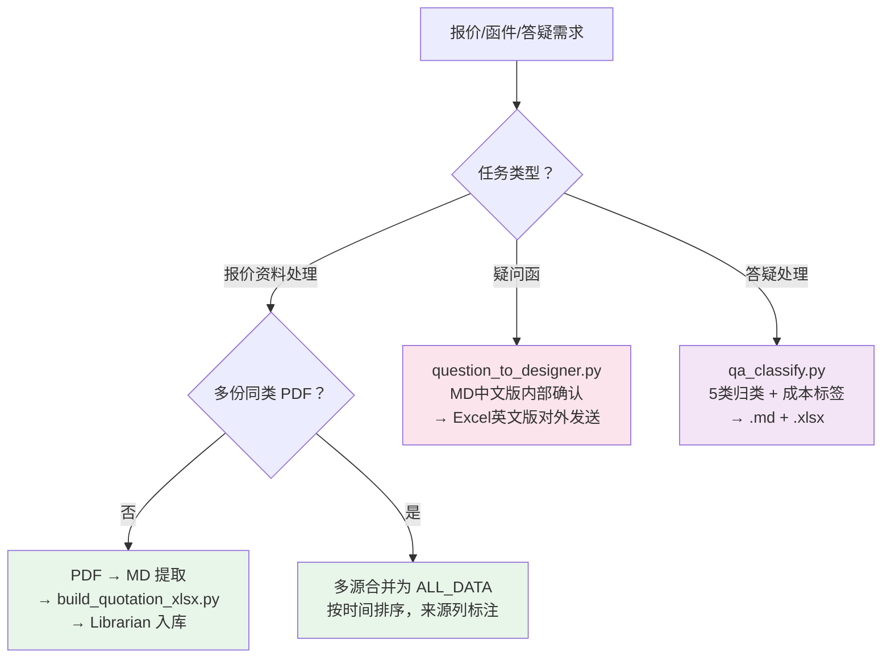

# PK BOQ — 报价提取与函件处理

> 清单合并/对比/校验等核心操作 → 触发 `pk-boq` 技能
> 工程造价约定、Excel 兼容性 → 见 `pk-boq` 技能

## 触发词速查

| 触发词 | 对应 |
|--------|------|
| 报价资料、quotation、人工单价、材料单价、价格表PDF、提取报价 | `build_quotation_xlsx.py` |
| 疑问函、致设计院、设计院澄清 | `question_to_designer.py` |
| 答疑分类、Q&A分类、回复整理 | `qa_classify.py` |

## 决策树



## build_quotation_xlsx.py — 报价资料处理

PDF 报价资料 → 标准化 人材机价格表 Excel（16 列，含来源追溯），可入库 Librarian 价格数据库。

```bash
# CLI 模式
python ../pk-boq/scripts/build_quotation_xlsx.py --data <data_file.py> [-o output.xlsx]

# Python API 模式
from build_quotation_xlsx import build_xlsx
build_xlsx(ALL_DATA, "output.xlsx", "标题", "副标题")
```

ALL_DATA 格式（8 元组或 12 元组）详见 [../pk-boq/references/scripts_reference.md](../pk-boq/references/scripts_reference.md)。
完整流程（PDF→MD→Excel→Librarian）→ [../pk-boq/references/quotation_workflow.md](../pk-boq/references/quotation_workflow.md)

## question_to_designer.py — 疑问函生成器

Python API 模式，两阶段：先 MD 中文版内部确认 → 后 Excel 英文版对外发送。

```python
from question_to_designer import QuestionConfig, build_question_xlsx
config = QuestionConfig(project_name="...", employer="...")
sections = [{"title": "【Section 1 ...】", "items": [...]}, ...]
build_question_xlsx(config, sections, "output.xlsx")
```

写作规则：
- Attachment Ref. 写文件名或报告章节号
- Question 简明扼要，不写 OM/DI 编号
- 数量比较：**设计清单量 vs 设计报告量**（同源），不对标招标清单
- Ask By 固定 "Peng Kang"

## qa_classify.py — 答疑分类汇总

将中英双语答疑 MD 按 5 类归类，标注成本影响等级，输出双语 .md + .xlsx。

```bash
# 双回复方模式
python ../pk-boq/scripts/qa_classify.py file1.md file2.md -o output_dir --project "Project Name"

# 单回复方模式
python ../pk-boq/scripts/qa_classify.py file1.md -o output_dir --project "Project Name"
```

输入：Markdown 表格 `Item | Query Ref | Question (EN) | Answer (EN) | Question (CN) | Answer (CN)`

5 大分类 + 成本标签：

| 分类 | 典型关键词 | 成本影响 |
|------|-----------|----------|
| 商务/合同条款 | 管辖法、仲裁、索赔、保险、履约保证金 | 高 |
| 技术/设计 | 设计、规范、图纸、结构、岩土、桩基 | 中/高 |
| 范围/界面 | 范围、界面、不包括、by others | 中 |
| 施工组织/现场 | 施工方法、临时设施、营地、进度 | 低/中 |
| 投标文件/程序 | 投标、招标、提交、澄清、不一致 | 低 |

完整流程（PDF→翻译→分类→重评估→交叉引用→影响总结）→ [../pk-boq/references/qa_processing_pipeline.md](../pk-boq/references/qa_processing_pipeline.md)

## 参考索引

| 文档 | 内容 |
|------|------|
| [../pk-boq/references/scripts_reference.md](../pk-boq/references/scripts_reference.md) | 完整 CLI 参数参考 |
| [../pk-boq/references/quotation_workflow.md](../pk-boq/references/quotation_workflow.md) | 报价资料全流程 |
| [../pk-boq/references/qa_processing_pipeline.md](../pk-boq/references/qa_processing_pipeline.md) | Q&A 全流程 |
