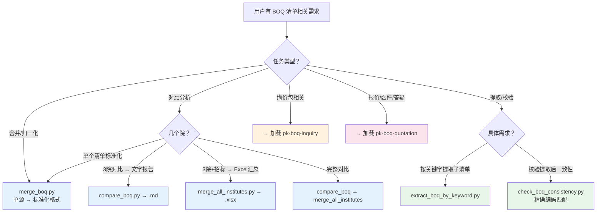
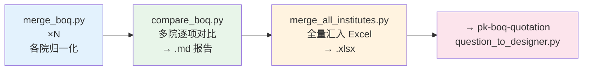

# PK BOQ — 工程造价清单核心处理

## 触发词速查

| 触发词 | 脚本 |
|--------|------|
| 合并清单、BOQ合并、归一化、标准化清单 | `merge_boq.py` |
| 多院对比、清单对比、BOQ对比、各家对比分析 | `compare_boq.py` |
| 全部合并、全量汇总、三院汇总、最终清单 | `merge_all_institutes.py` |
| 校验清单、一致性检查、BOQ校验、核对工程量、源文件比对 | `check_boq_consistency.py` |
| 关键字提取、按关键词拆分、筛选特定条目 | `extract_boq_by_keyword.py` |

> 询价包拆分 / 主材表 / 图纸分发 → 触发 `pk-boq-inquiry` 技能
> 报价提取 / 疑问函 / 答疑分类 → 触发 `pk-boq-quotation` 技能

## 决策树



## 典型流程



## 脚本速查

> 完整 CLI 参数见 [references/scripts_reference.md](references/scripts_reference.md)

### merge_boq.py — 单源归一化

将一个设计院的原始清单转为标准化格式（层级配色、数字会计格式、行分组）。

```bash
python merge_boq.py <source.xlsx> [-o output.xlsx]
```

自动检测列布局，4 级层级识别（`【】`→`《》`→`{}`→普通条目），xlsxwriter 原生输出。

### compare_boq.py — 多院对比分析

以一院为基准逐项匹配其他院，输出 Markdown 对比报告。

```bash
python compare_boq.py --wtcc <基准> --fhdi <院2> --sghcc <院3> [-o report.md]
```

匹配三级降级：精确编码 → 前缀匹配 → 语义相似度 > 0.75。每条目标注 MATCHED/UNMATCHED。

### merge_all_institutes.py — 全量合并汇总

所有设计院 + 招标清单汇入单一 Excel。

```bash
python merge_all_institutes.py --wtcc <基准> --fhdi <院2> --sghcc <院3> --tender <招标清单> [-o merged.xlsx]
```

### check_boq_consistency.py — 清单一致性校验

验证提取/复制的 BOQ 与源文件是否一致（精确编码匹配，非模糊对比）。

```bash
python check_boq_consistency.py target.xlsx --config mappings.json
```

> **脚本报出大面积差异（>5条）时，必须先抽查源文件 2-3 条确认是真差异还是误报，不得直接把脚本结论报告用户。** 常见误报：源文件同一编码在不同子方案中重复出现。

### extract_boq_by_keyword.py — 按关键字提取子清单

从合并 BOQ 中按关键字筛选条目，保留层级关系，模板样式输出。

```bash
python extract_boq_by_keyword.py <source.xlsx> <keyword> <template.xlsx> [-o output.xlsx]
```

openpyxl 实现（需读源文件 + 模板合并表头）。

## 跨切面规则

### 工程造价约定

- **OM/DI 编号**：OM（遗漏项目）、DI（描述不完善），独立递增贯穿分析
- **DB 合同**：FIDIC 黄皮书 DB 模式，清单不是计价依据而是报价统一口径
- **数量比较基准**：设计清单量 vs 设计报告量（同源），不对标招标清单
- 完整约定 → [references/boq_conventions.md](references/boq_conventions.md)

### Excel 兼容性

- **优先 xlsxwriter 新建**，避免 openpyxl 修改现有文件
- 危险组合：`merge_cells()` + `PatternFill()` → Office 修复模式
- 例外：`extract_boq_by_keyword.py` 用 openpyxl（需读源文件）
- 详见 → [references/excel_compatibility.md](references/excel_compatibility.md)

### BOQ 层级体系

四级层次 `L1【】→ L2《》→ L3{}→ L4 条目`，行分组形成逐级折叠。详见 → [references/boq_hierarchy_rules.md](references/boq_hierarchy_rules.md)

### 输出命名

`{YYYY-MM-DD}_BOQ_{内容}.{ext}`

## 参考索引

| 文档 | 内容 |
|------|------|
| [scripts_reference.md](references/scripts_reference.md) | 完整 CLI 参数 |
| [boq_conventions.md](references/boq_conventions.md) | 工程造价约定 |
| [boq_hierarchy_rules.md](references/boq_hierarchy_rules.md) | 四级层级、样式、行分组 |
| [excel_compatibility.md](references/excel_compatibility.md) | Excel 兼容性规范 |

## 子技能

| 技能 | 用途 |
|------|------|
| `pk-boq-inquiry` | 询价包拆分、图纸分发、主材表/市场询价表 |
| `pk-boq-quotation` | 报价资料提取、疑问函生成、答疑分类汇总 |

## 跨技能引用

| 技能 | 用途 |
|------|------|
| `xlsx` | 底层 Excel 读写、公式重算 |
| `translation-agent` | 清单中英文双向翻译 |
| `thinking-in-files` | 复杂多步骤推理时打草稿 |
