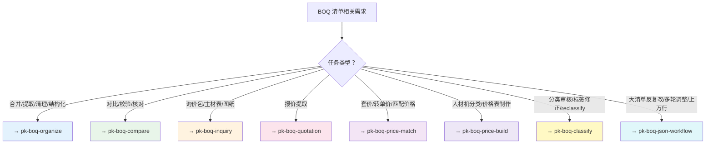

# PK BOQ — 技能族

> 本技能为轻量路由器，具体工作流和脚本用法见各子技能。

## 子技能

| 技能 | 用途 | 包含 |
|------|------|------|
| `xlsx-clean-external-links` | 清除链接（独立） | Excel外部链接清理专用，精准匹配"清除外部链接"触发词 |
| `pk-boq-organize` | 整理 | 单源归一化合并、关键字提取子清单、清理外部链接、Excel-AST结构化 |
| `pk-boq-compare` | 对比检查 | 清单对比分析（三级匹配降级）、清单一致性校验（精确编码匹配） |
| `pk-boq-inquiry` | 询价包与主材表 | BOQ清单拆分、图纸分发、主材表提炼/市场询价表 |
| `pk-boq-quotation` | 报价提取 | PDF报价→标准化Excel→Librarian入库 |
| `pk-boq-price-match` | 单价套价 | 源清单单价→目标清单：编号+名称两级匹配，写入单价和合价公式 |
| `pk-boq-price-build` | 人材机价格表 | 原始数据→YAML规则分类→BOQ格式价格表，带分级标题和行分组 |
| `pk-boq-classify` | 分类标签审核修正 | 按{}区域提取→聚合去重→LLM语义审核→批量回写，修正自动分类错误 |
| `pk-boq-json-workflow` | 大型清单增量修改 | ≥5000行 BOQ 反复调整时的 master JSONL + 分片工作流,xlsx 只作交付格式 |

## 决策树

## 跨切面规则

- **OM/DI 编号**：独立递增贯穿分析 → [references/boq_conventions.md](references/boq_conventions.md)
- **BOQ 层级**：`L1【】→ L2《》→ L3{}→ L4 条目` → [references/boq_hierarchy_rules.md](references/boq_hierarchy_rules.md)
- **Excel 库选择**：写用 `xlsxwriter`，读用 `fastexcel`，仅在读改回写时才用 `openpyxl` → [references/excel_compatibility.md](references/excel_compatibility.md)
- **输出命名**：`{YYYY-MM-DD}_BOQ_{内容}.{ext}`

## 脚本与参考索引

| 脚本 / 文档 | 所属技能 |
|-------------|----------|
| `merge_boq.py` | pk-boq-organize |
| `extract_boq_by_keyword.py` | pk-boq-organize |
| `clean_external_links.py` | pk-boq-organize |
| `compare_boq.py` | pk-boq-compare |
| `check_boq_consistency.py` | pk-boq-compare |
| `split_inquiry_boq.py` | pk-boq-inquiry |
| `build_inquiry_materials.py` | pk-boq-inquiry |
| `build_quotation_xlsx.py` | pk-boq-quotation |
| `transfer_prices.py` | pk-boq-price-match |
| `build_price_sheet.py` | pk-boq-price-build |
| `extract_regions.py` | pk-boq-classify |
| `batch_correct.py` | pk-boq-classify |

| 参考文档 | 内容 |
|----------|------|
| [references/scripts_reference.md](references/scripts_reference.md) | 完整 CLI 参数 |
| [references/boq_conventions.md](references/boq_conventions.md) | 工程造价约定 |
| [references/boq_hierarchy_rules.md](references/boq_hierarchy_rules.md) | 四级层级、样式、行分组 |
| [references/excel_compatibility.md](references/excel_compatibility.md) | Excel 兼容性规范 |

## 跨技能引用

| 技能 | 用途 |
|------|------|
| `document-ingest` | Excel 结构探测、列自动检测 |
| `xlsx` | 底层 Excel 读写、公式重算 |
| `translation-agent` | 清单中英文双向翻译 |
| `thinking-in-files` | 复杂多步骤推理时打草稿 |
