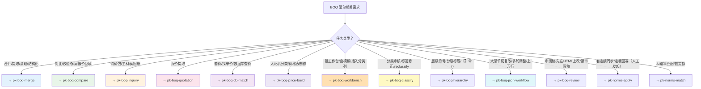

# PK BOQ — 技能族

> 本技能为轻量路由器，具体工作流和脚本用法见各子技能。

## 子技能

| 技能 | 用途 | 包含 |
|------|------|------|
| `pk-boq-ai-team` | 处理策略（元） | 大表铁律 + AI 团队协作：数据前端(fastexcel读→区域聚合→LLM看模式→Python回写) + 8阶段流水线。>50行先调此技能 |
| `xlsx-purge` | 净化 xlsx（独立） | 定义名称净化 + 外部链接清除，ZIP/XML 底层操作。`--mode names/links/all` 分开两件事 |
| `pk-boq-merge` | 合并 | 多源归一化合并、关键字提取子清单、清理外部链接。合并完自动调用 apply_hierarchy.py（`--no-hierarchy` 跳过） |
| `pk-boq-compare` | 对比检查 | 清单对比分析（三级匹配降级）、清单一致性校验（精确编码匹配）、多局报价回填（match_boq_prices.py + fill_boq_prices.py，匹配JSON复用） |
| `pk-boq-inquiry` | 询价包与主材表 | BOQ清单拆分、图纸分发、主材表提炼/市场询价表 |
| `pk-boq-quotation` | 报价提取 | PDF报价→标准化Excel→Librarian入库 |
| `pk-boq-db-match` | 数据库套价 | BOQ项↔报价数据库(CostSpread rates)语义匹配：LLM分层团队+术语表双语检索，单价填入Q-Z列 |
| `pk-boq-price-build` | 人材机价格表 | 原始数据→YAML规则分类→BOQ格式价格表，带分级标题和行分组 |
| `pk-boq-classify` | 分类打标签 | 只读清单判定 Discipline/SortKey/Category/Subcategory/Element 五列，闭词表约束，产出 classification.json。**排在建工作台之前** |
| `pk-boq-workbench` | 建报价工作台 | 在原清单上插入工作台：原始清单区（No.→XXX Amount）只增不改，两侧插键列/分类列/AI套价列 + 三个透视表 + Unique Shot 快照页；`--classification` 把分类值一并写入 |
| `pk-boq-hierarchy` | 层级符号与分组 | 给标题行打【】《》{}、颜色填充、outline分组。核心：有单位+数量→强制L4 |
| `pk-boq-json-workflow` | 大型清单增量修改 | ≥5000行 BOQ 反复调整时的 master JSONL + 分片工作流,xlsx 只作交付格式 |
| `pk-boq-review` | HTML 审阅模式 | 改清单前生成 1:1 审阅稿，用户改单元格、写意见、保存，AI 读回后改版 |
| `pk-norms-apply` | 定额回写（人工发起） | UniqueBQ ↔ 主清单 按列名回写。**不接在 pk-norms-match 后面**，只在明确要求"同步/定额回写"时调用 |
| `pk-norms-match` | AI语义套定额 | Claude 语义理解匹配 BOQ 条目到定额库。**职责止于产出匹配结果**，回写到哪列由人工决定 |

## 决策树


```mermaid
flowchart TD
    START["BOQ 清单相关需求"] --> Q1{"任务类型？"}

    Q1 -->|"合并/提取/清理/结构化"| MERGE["→ pk-boq-merge"]
    Q1 -->|"对比/校验/多局报价回填"| COMPARE["→ pk-boq-compare"]
    Q1 -->|"询价包/主材表/图纸"| INQUIRY["→ pk-boq-inquiry"]
    Q1 -->|"报价提取"| QUOTATION["→ pk-boq-quotation"]
    Q1 -->|"套价/找单价/数据库查价"| DB_MATCH["→ pk-boq-db-match"]
    Q1 -->|"人材机分类/价格表制作"| PRICE_BUILD["→ pk-boq-price-build"]
    Q1 -->|"建工作台/套模板/插入分类列"| WORKBENCH["→ pk-boq-workbench"]
    Q1 -->|"分类审核/标签修正/reclassify"| CLASSIFY["→ pk-boq-classify"]
    Q1 -->|"层级符号/分级标题/【】《》{}"| HIERARCHY["→ pk-boq-hierarchy"]
    Q1 -->|"大清单反复改/多轮调整/上万行"| JSONWF["→ pk-boq-json-workflow"]
    Q1 -->|"审阅稿/先在HTML上改/读审阅稿"| REVIEW["→ pk-boq-review"]
    Q1 -->|"套定额同步/定额回写（人工发起）"| NORMS_APPLY["→ pk-norms-apply"]
    Q1 -->|"AI语义匹配/套定额"| NORMS_MATCH["→ pk-norms-match"]

    style MERGE fill:#e3f2fd
    style COMPARE fill:#e8f5e9
    style INQUIRY fill:#fff3e0
    style QUOTATION fill:#fce4ec
    style DB_MATCH fill:#f3e5f5
    style PRICE_BUILD fill:#ede7f6
    style WORKBENCH fill:#ffe0b2
    style CLASSIFY fill:#fff9c4
    style JSONWF fill:#e0f7fa
```

## 跨切面规则

- **禁止 Excel COM**：见下方专节，全技能族适用，无例外
- **OM/DI 编号**：独立递增贯穿分析 → [references/boq_conventions.md](references/boq_conventions.md)
- **BOQ 层级**：`L1【】→ L2《》→ L3{}→ L4 条目` → [pk-boq-hierarchy/references/boq_hierarchy_rules.md](../pk-boq-hierarchy/references/boq_hierarchy_rules.md)
- **Excel 库选择**：写用 `xlsxwriter`，读用 `fastexcel`，仅在读改回写时才用 `openpyxl` → [references/excel_compatibility.md](references/excel_compatibility.md)
- **输出命名**：`{YYYY-MM-DD}_BOQ_{内容}.{ext}`

## 禁止用 Excel COM 处理表格

**全局硬规则的 BOQ 细化** —— 总规则在 `~/.claude/CLAUDE.md` 的「Excel/AI 加速工具集」硬前置，适用于任何项目任何技能，不止 BOQ。

**不准启动 Excel 来读写、标记、插行、刷新或校验表格。** 包括 `win32com.client.Dispatch("Excel.Application")`、`DispatchEx`、`excel` MCP（COM 版）、以及任何间接拉起 `EXCEL.EXE` 的做法。

理由是它挡着人干活：

- **抢占用户的 Excel**。`Dispatch` 会附着到用户正开着的实例，脚本一跑，用户手里的表被接管、弹窗、焦点乱跳，`Visible = False` 对已有实例还无效。
- **要人配合**。用户得先关掉手上的文件、等脚本跑完、再打开，本来一条命令的事变成来回操作。
- **不稳且慢**。约 8 秒固定启动开销（实测 7500 行 COM 13.6 秒 vs 纯脚本 5.5 秒）；异常退出会残留 `EXCEL.EXE` 占着文件；跨工作簿搬透视表、命名参数传递都有一堆坑。
- **依赖本机装了 Excel**，headless / cron 场景直接跑不了。

### 该用什么

| 要做的事 | 用什么 |
|---------|--------|
| 读数据值 | `fastexcel`（比 openpyxl 快 9-16x） |
| 读公式文本、保留格式改单元格 | `openpyxl` |
| 新建表 | `xlsxwriter` |
| 插列 / 插行 / 搬 sheet / 透视表 / 定义名称 / 清部件 | **zip + XML 层直接改**，其余部件字节级复制 |
| 让透视表出数 | 写 `refreshOnLoad="1"`，用户打开时 Excel 自己刷新 |
| 验证产物没坏 | 用 `openpyxl.load_workbook()` 能打开 + 脚本核对部件/公式/填充率，**不要开 Excel 看** |

`pk-boq-workbench/scripts/build_workbook.py` 是完整范例：套模板、插列、写公式、带透视表、清快照页，全程 zip/XML，一次 Excel 都没起。

### "openpyxl 会破坏公式" 不是用 COM 的理由

`insert_rows` 确实会让公式行引用错乱，但解法是在 zip/XML 层插行并自己平移行号，不是去开 Excel。**现成的轮子：`scripts/xlsx_rowops.py`**

```python
from xlsx_rowops import SheetEditor
ed = SheetEditor("in.xlsx", "合并报表")
ed.insert_row(after=20, values={5: "新增条目", 6: "m2", 7: 12.5}, fill="00FF00")
ed.set_cell(12, 6, "m2")
ed.fill_row(12, "FFFF00")
ed.save("out.xlsx")
```

行号一律按**原表**给，多处插入的偏移内部统一算，不用从后往前排。插行后自动处理：所有公式的行引用（含绝对引用 `$U$44` → `$U$45`、汇总范围 `SUBTOTAL(9,N5:N43)` → `N5:N44`）、合并单元格 / 条件格式 / 数据验证的范围、定义名称、dimension，并清掉 calcChain（三处一起清）。整行上色按 (原样式, 颜色) 派生新 xf，不动原样式，字体边框跟着走。

### 唯一的例外

用户明确说"用 Excel 打开确认一下"时才可以起 Excel，并且必须 `DispatchEx`（建独立实例，不碰用户开着的文件）、`Visible = False`、`finally` 里确保 `Quit()`。做完即退，不要留着。

## 脚本与参考索引

| 脚本 / 文档 | 所属技能 |
|-------------|----------|
| `merge_boq.py` | pk-boq-merge |
| `extract_boq_by_keyword.py` | pk-boq-merge |
| `xlsx_purge.py` | xlsx-purge |
| `verify.py` | xlsx-purge |
| `compare_boq.py` | pk-boq-compare |
| `check_boq_consistency.py` | pk-boq-compare |
| `mark_boq_three_color.py` | pk-boq-compare |
| `xlsx_rowops.py` | 通用（zip/XML 行级编辑：插行 + 公式行引用平移 + 整行上色，不启动 Excel） |
| `match_boq_prices.py` | pk-boq-compare |
| `fill_boq_prices.py` | pk-boq-compare |
| `split_inquiry_boq.py` | pk-boq-inquiry |
| `build_inquiry_materials.py` | pk-boq-inquiry |
| `build_quotation_xlsx.py` | pk-boq-quotation |
| `build_price_sheet.py` | pk-boq-price-build |
| `extract_regions.py` | pk-boq-classify |
| `batch_correct.py` | pk-boq-classify |

| 参考文档 | 内容 |
|----------|------|
| [references/scripts_reference.md](references/scripts_reference.md) | 完整 CLI 参数 |
| [references/boq_conventions.md](references/boq_conventions.md) | 工程造价约定 |
| [../pk-boq-hierarchy/references/boq_hierarchy_rules.md](../pk-boq-hierarchy/references/boq_hierarchy_rules.md) | 四级层级、样式、行分组 |
| [references/excel_compatibility.md](references/excel_compatibility.md) | Excel 兼容性规范 |

## 跨技能引用

| 技能 | 用途 |
|------|------|
| `document-ingest` | Excel 结构探测、列自动检测 |
| `xlsx` | 底层 Excel 读写、公式重算 |
| `translation-agent` | 清单中英文双向翻译 |
| `thinking-in-files` | 复杂多步骤推理时打草稿 |
