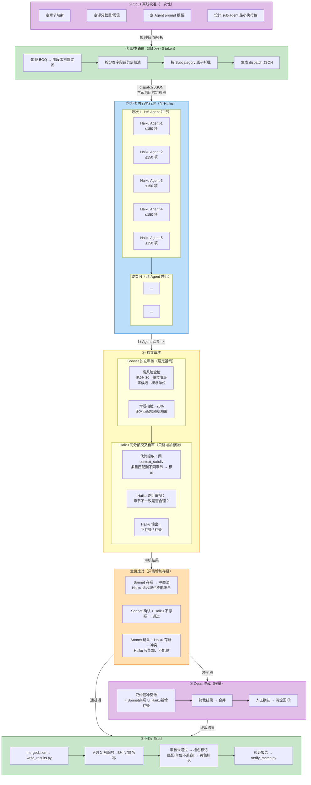

# AI 团队协作拓扑图 — 套定额 v1.0

> 套定额工作流最重要的指导文件。展示了从 BOQ 到 Excel 输出的 8 阶段分层流水线，
> 各阶段模型分配、数据流方向、核心约束。源自 `pk-boq-ai-team` 模式 B。
>
> 版本规则：修改前先 `cp teamline_v1.0.md archive/teamline_v1.0.md` 归档，再改此文件。旧版统一放 `archive/`。

## 8 阶段流水线总图



## 模型分工与独立信号

```mermaid
flowchart LR
    subgraph DESIGN["设计者 · Opus"]
        D1["离线校准规则"]
        D2["设计 sub-agent 最小执行包"]
        D3["终裁争议项"]
    end

    subgraph EXECUTOR["执行者 · Haiku"]
        E1["全量语义匹配<br/>150项/Agent × N波次"]
        E2["低歧义快速判定"]
        E3["直接写入结果 .txt"]
    end

    subgraph REVIEWER["审核者 · Sonnet"]
        R1["高风险全检<br/>低分/降级/零候选"]
        R2["常规抽检 ~20%"]
        R3["设定基线：确认/存疑"]
    end

    subgraph SELF_REVIEW["自审者 · Haiku"]
        H1["同分部交叉审视<br/>换个角度查自己"]
        H2["只能增加存疑<br/>不能洗白 Sonnet"]
    end

    subgraph DECIDER["决策者 · Opus"]
        DC1["只仲裁冲突池"]
        DC2["Sonnet存疑 ∪ Haiku新增存疑"]
    end

    DESIGN -->|"规则"| EXECUTOR
    EXECUTOR -->|"匹配结果"| REVIEWER
    REVIEWER -->|"基线判定"| SELF_REVIEW
    SELF_REVIEW -->|"存疑合并"| DECIDER
    DECIDER -.->|"沉淀回"| DESIGN

    style DESIGN fill:#e1bee7,stroke:#7b1fa2
    style EXECUTOR fill:#bbdefb,stroke:#1565c0
    style REVIEWER fill:#fff9c4,stroke:#f9a825
    style SELF_REVIEW fill:#bbdefb,stroke:#1565c0
    style DECIDER fill:#e1bee7,stroke:#7b1fa2
```



**核心铁律**：
- **换模型 = 独立信号**：Haiku → Sonnet → Opus，三个不同模型，三重独立信号
- **换视角 = 独立信号**：Haiku 执行时逐条匹配，自审时按同分部一致性审视——同一模型、不同视角，避免惯性思维
- **自审只能增加存疑**：Haiku 自审不能推翻 Sonnet 的判定，只能把 Sonnet 放过的项重新拉回冲突池。方向单向——越审越严

## 信号流：只能增加存疑

```
Haiku 执行匹配 ──→ Sonnet 审核（基线）──→ 确认 ──→ Haiku 自审 ──→ 不存疑 → 通过
       │                    │                          │
       │                    │                          └── 存疑 → 冲突池 (+)
       │                    │
       │                    └── 存疑 → 冲突池（不可洗白）
       │
       └── 所有结果同时送给 Sonnet 和 Haiku 自审
```

| Sonnet | Haiku 自审 | 结果 |
|--------|-----------|------|
| 确认 | 不存疑 | **通过** |
| 确认 | 存疑 | **冲突**（Haiku 新增） |
| 存疑 | 不存疑 | **冲突**（Haiku 不能洗白） |
| 存疑 | 存疑 | **冲突**（双方一致） |

> 冲突池 = Sonnet 存疑 ∪ Haiku 新增存疑。**取并集，不取交集。**

## 审核覆盖模型

### Sonnet 审核（设定基线）

| 审核层 | 覆盖 | 机制 |
|--------|------|------|
| 脚本完整性 | 100% | 行数=输入、格式可解析、判定类型五选一、统计一致 |
| 高风险全检 | 高风险 100% | 低分(<30)、单位降级、零候选、概念单位 → 全部送 Sonnet |
| 常规抽检 | ~20% | 正常匹配项随机抽取，逆向验证匹配合理性 |

### Haiku 同分部交叉自审（只能增加存疑）

| 步骤 | 执行者 | 内容 |
|------|--------|------|
| 1. 提取分组 | 代码 | 按 context_subdiv 分组，找出同组内匹配到不同章节的条目 |
| 2. 逐组审视 | Haiku | 阅读该组所有条目 + 各自的匹配结果，判断章节不一致是否合理 |
| 3. 输出意见 | Haiku | 每条：不存疑(合理) / 存疑(应修正) + 理由 |
| 4. 并入冲突池 | 代码 | Haiku 存疑的项加入冲突池，与 Sonnet 存疑取并集，送 Opus 仲裁 |

## Token 优化策略

审核环节带来的额外 token 消耗约在执行层的 15-25%，通过以下策略控制在可接受范围。

### 各阶段输入对比

| 阶段 | 模型 | 输入规模 | 携带内容 |
|------|------|----------|----------|
| 执行 | Haiku | **100%** 条目 | BOQ 条目 + 裁剪后定额池(~50条) + 完整 prompt |
| Sonnet 审核 | Sonnet | **~35-45%** 条目 | BOQ 条目 + 匹配结果（无需定额池） |
| Haiku 自审 | Haiku | **~5-10%** 条目 | 仅异常组（同 subdiv 跨章节）+ 匹配结果 |
| Opus 仲裁 | Opus | **冲突池** | 条目 + 匹配结果 + 双方意见摘要（无需定额池） |

### 五项优化

**1. Sonnet 审核：合并批次，减少 overhead**

高风险项分散在各 Agent 结果中。不要逐个 Agent 调 Sonnet，而是将所有 Agent 的高风险项 + 抽检项收集为一个批次，一次 prompt 审完。省掉多次 system prompt 和任务说明的重复发送。

```
分散调用: Sonnet × N 次（每个 Agent 一次）→ N × system_prompt_overhead
合并批次: Sonnet × 1 次（全部高风险+抽检合并）→ 1 × system_prompt_overhead
```

**2. Haiku 自审：不送全部条目，只送异常组**

代码先提取「同 context_subdiv 内匹配到不同章节」的组。假设 3,500 条清单有 200 个 context_subdiv，跨章节异常组通常只有 20-30 个。Haiku 自审输入仅这 20-30 组，而非全部 3,500 条。

```
全量自审: Haiku 审 3,500 条 → 爆炸
异常组自审: Haiku 审 ~200-350 条（20-30组 × 5-15条/组）→ 可控
```

**3. 去重叠：Sonnet 已审的，Haiku 跳过硬判断**

| Sonnet 判定 | Haiku 自审行为 | 原因 |
|-------------|---------------|------|
| 存疑 | **跳过** | 已进冲突池，无需 Haiku 重复确认 |
| 确认 | 正常审视 | 需要 Haiku 从同分部角度检验是否有遗漏 |

代码层实现：Sonnet 存疑项直接从 Haiku 自审输入中排除。

**4. 仲裁上下文裁剪**

Opus 仲裁不需要完整定额池。只送最小上下文：

```
输入: BOQ条目 + 匹配的定额名称/编码/单位 + Sonnet意见(1句) + Haiku意见(1句)
不送: 完整定额池、work_content全文、评分明细、匹配过程
```

**5. 执行包瘦身：Agent 只拿最小上下文**

这是 ① Opus 校准阶段的核心任务——设计 sub-agent 执行包时，**只给 Agent 匹配所需的最小信息，不给完整技能上下文**。

当前 agent_prompt_template.md 已瘦身（104→48 行，~60% 削减）：

| 砍掉的内容 | 原因 |
|-----------|------|
| 分类字段定位（14行） | ② 脚本已按分类裁剪定额池，Agent 无需知道分类逻辑 |
| 零工程量/概念单位检查（7行→1行） | 阶段零前置过滤已处理 |
| MEP/检测/开办费陷阱（3条） | 分类字段已排除，不会进入 Agent 的池 |
| 统计汇总（6行） | 脚本自统计 |
| 输出示例（5条→2条） | 格式说明 2 条足够 |

瘦身效果：每 Agent system prompt 从 ~1,500 token → ~600 token。20 个 Agent 净省 18,000 token。

核心原则：Agent 只做匹配，不需要知道分类怎么分的、过滤怎么滤的、统计怎么统的。那些是 ② 脚本路由、阶段零过滤和 ⑥ 审核的事。

### 优化效果估算

以 3,500 条 BOQ 为例：

| 指标 | 优化前 | 优化后 | 节省 |
|------|--------|--------|------|
| 执行 Agent prompt | ~1,500 token/Agent | ~600 token/Agent | ~60% |
| Sonnet 调用次数 | N 次（每 Agent） | 1 次（合并批） | ~80% overhead |
| Haiku 自审条目数 | 3,500（全量） | ~250（仅异常组） | ~93% |
| 重叠审查 | Sonnet + Haiku 都审 | 互斥去重 | ~15-20% |
| 仲裁输入 | 完整上下文 | 冲突摘要 | ~70% |

综合：执行层 token ↓60%，审核层新增 token 控制在执行层的 **15-20%**。整体不升反降。

## 匹配决策字段

### BOQ 端（输入）

| 优先级 | 字段 | 用途 |
|--------|------|------|
| 1 | `name` | 最核心，描述施工工序实质 |
| 1 | `description` | 补充规格参数、施工方法和范围描述 |
| 2 | `Discipline` | 定位工程专业（土建/机电/市政），缩小到册 |
| 2 | `Subcategory` | 定位子分部，缩小到章 |
| 3 | `dept3` | 无分类时替代 Subcategory，最深层分组标题 |
| 3 | `unit` | 单位兼容性第一关 |
| 3 | `qty` | 零工程量 → 跳过 |
| 4 | `context_subdiv` | 同子分部条目约束到同一/相近章节 |
| 4 | `dept1` / `dept2` | 大方向兜底，排除明显不相关的章节 |

### 定额库端（候选）

| 优先级 | 字段 | 用途 |
|--------|------|------|
| 1 | `section_title` | 定额名称，最关键匹配字段 |
| 1 | `work_content` | 工序内容描述，区分同名定额的施工方法（水上/陆上、机械/人工） |
| 2 | `unit` | 定额单位，与 BOQ 单位做兼容性验证 |
| 2 | `chapter.title` | 章节归属，验证是否落在 target_chapters 内 |
| 3 | `cost_item` | 人材机组成，验证 BOQ 描述的「砼」是否真有混凝土材料 |
| 3 | `attr_level1-4` | 属性层级，区分相似定额的规格差异（桩径、标号等），description 已含规格，仅作辅助验证 |
| — | `norms_code` | 完整路径编码，最终输出值（非匹配依据） |

### 对应七维评分

```
name + description  ──→  section_title      关键词命中(#1) +25/词
Discipline/Subcat   ──→  chapter.title      章节匹配(#2) +15
unit                ──→  unit               单位匹配(#3) +30~-100
description         ──→  cost_item          人材机一致性(#4) +40/-50
description         ──→  work_content       工序内容匹配(#5) +20
description         ──→  attr_level1-4      属性层级匹配(#6) +10
                    排除规则(#7) -50/词
```

## 核心约束速查

| 约束 | 值 | 原因 |
|------|-----|------|
| 每 Agent 条目上限 | 150 | 注意力衰减 |
| 并发 Agent 上限 | 5 | 系统资源 + API 限速 |
| 执行模型 | Haiku | 全量执行，低成本跑量 |
| 审核模型 | Sonnet | 独立信号，设定基线 |
| 自审模型 | Haiku | 换视角（同分部一致性），只能增加存疑 |
| 仲裁模型 | Opus | 限量，只仲裁冲突池 |
| 得分阈值 | 30 | 低于此分标记为「得分不足」 |
| 高风险送审率 | 100% | 低分/降级/零候选/概念单位 → 全部 Sonnet 审核 |
| 常规抽检率 | 20% | 正常匹配项随机抽取 |
| 同分部交叉自审 | 100% | 按 context_subdiv 分组，章节不一致的逐组 Haiku 审视 |

## 7 条核心原则

1. **角色分工把关** — 设计者(Opus) → 执行者(Haiku) → 审核者(Sonnet) + 自审者(Haiku) → 决策者(Opus)，四角色互不补台
2. **换模型 = 独立信号** — Sonnet 审核与 Haiku 执行是不同模型，信号不相关
3. **换视角 = 独立信号** — Haiku 自审与执行是不同视角（同分部一致性 vs 逐条匹配），避免惯性思维
4. **自审只能增加存疑** — 冲突池 = Sonnet 存疑 ∪ Haiku 新增存疑，取并集。Haiku 不能洗白 Sonnet 的判定
5. **0 token 优先** — 脚本能判的绝不给 LLM：阶段零过滤、阶段二路由、脚本完整性检查、同分部分组提取
6. **贵模型限量** — Opus 只仲裁冲突池，不做常规执行或审核
7. **人工确认沉淀回规则库** — 未决项由人兜底，Opus 终裁 + 人工确认结果写回 ① 规则库/黄金集，下次自动复用
