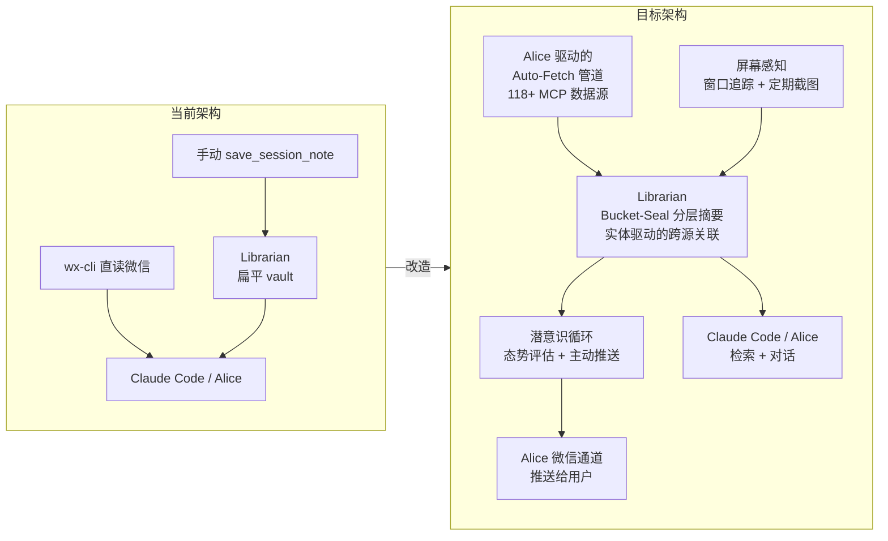
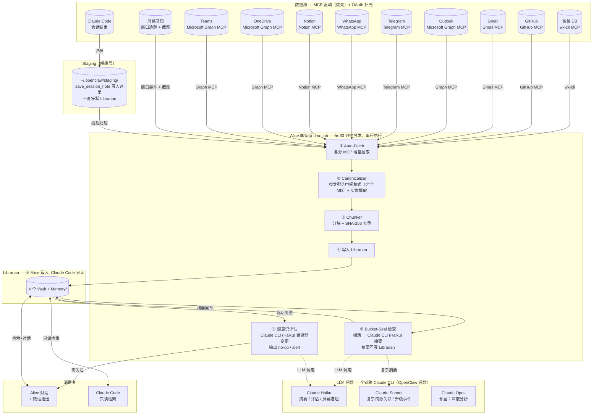

# 记忆系统改造 — 目标架构 & 风险评估

> 日期: 2026-05-21
> 核心思路: Alice (OpenClaw) 作为持久记忆引擎，接管被动摄入 + 自动组织 + 主动推送。Claude Code 保持为交互式工具。
> LLM 策略: 全链路 Claude CLI 驱动（OpenClaw 后端），不引入本地模型。

---

## 1. 当前 vs 目标 对比



**核心变化**: 从"手动归档 + 被动检索"变成"自动摄入 + 自动组织 + 主动推送 + 屏幕感知"。

---

## 2. 目标架构全景



---

## 3. 新增组件说明

### 3.1 单管道 cron job（串行执行，Claude CLI 驱动）

所有后台任务合并为**一个 cron job**，每 30 分钟触发。LLM 调用通过 Claude CLI（OpenClaw 后端）完成，不引入本地模型：

```
job: memory-pipeline
  ├─ ① Auto-Fetch: 从微信/GitHub/Gmail/Outlook/Telegram/WhatsApp/Notion/OneDrive/Teams/staging/屏幕 拉增量
  ├─ ② Canonicalize: 按类型选中间格式（非全 MD）+ 实体提取
  ├─ ③ Chunk: 分块 + SHA-256 去重
  ├─ ④ Write: 写入 Librarian vault
  ├─ ⑤ Bucket-Seal 检查: 桶满 → Claude CLI (Haiku) 摘要 → 回写
  └─ ⑥ 潜意识评估: Claude CLI (Haiku) 读近期变更 → no-op 或推送
```

**为什么串行就够了**：各阶段天然存在依赖关系（摘要依赖写入，评估依赖摘要），分开跑反而是错的。一个 cron job 顺序跑完，零并发冲突。

**为什么 30 分钟**：OpenHuman 的 auto-fetch 间隔是 20 分钟。Claude API 调用有成本，30 分钟在"及时性"和"API 成本"之间取得平衡。

**LLM 调用成本控制**：
- 管道内 LLM 调用使用 **Claude Haiku**（最便宜模型），仅复杂跨源关联升级到 Sonnet
- 每次管道运行最多 2-3 次 LLM 调用（摘要 1-2 次 + 评估 1 次）
- Haiku 定价 ~$0.25/MTok input, ~$1.25/MTok output — 每次调用约 $0.001-0.005
- 日均 48 次管道运行，预估日成本 <$0.50

### 3.2 Staging 目录（解耦 Claude Code 与 Librarian）

```
Claude Code 会话结束
  → save_session_note 写入 ~/.openclaw/staging/
  → Alice cron 的 ① Auto-Fetch 捡起 staging 中的文件
  → 通过正常管道摄入 Librarian
```

**为什么需要这个**：
- Claude Code 不再直接写 Librarian → 消除所有潜在的写冲突
- staging 是文件系统操作，不会触发 SQLite 锁
- 如果 Alice 挂了，会话归档在 staging 里排队，恢复后自动摄入

### 3.3 Canonicalizer 升级

**当前**: 所有数据转 Markdown
**目标**: 按类型分流——

| 数据类型 | 中间格式 |
|---------|---------|
| 微信聊天 | Threaded JSON (保留 reply_to 线程关系) |
| Excel/电子表格 | Semantic JSON (保留公式、命名范围、类型信息) |
| GitHub PR/Issue | JSON 元数据 + Markdown body |
| 邮件 | JSON 元数据 + Markdown body |
| PDF/文档/网页 | Markdown |
| Claude Code 会话 | 结构化摘要 JSON |

同时嵌入**实体提取**：从每条数据中提取 person/project/topic 实体，建立跨源关联索引。

### 3.4 Bucket-Seal 摘要引擎

```
L0 缓冲区 (桶)
  ├─ 触发条件: ≥ 10 条记忆 或 ≥ 50,000 token
  ├─ 动作: Claude CLI (Haiku) 生成 Source 级摘要
  └─ 原始数据保留，摘要注入索引

L1 (Source 级)
  ├─ 触发条件: ≥ 10 个 Source 摘要
  ├─ 动作: Claude CLI (Sonnet) 生成 Topic 级摘要
  └─ 按 person/project/topic 跨源聚合

L2 (Topic 级 — 远期)
  └─ 触发条件: ≥ 10 个 Topic 摘要
     └─ Claude CLI (Sonnet/Opus) 生成 Global 摘要
```

**关键设计**: 热路径不调 LLM。数据摄入时只评分和写入。LLM 仅在桶满时惰性调用。摘要用 Haiku（便宜），跨源聚合用 Sonnet（需要更强推理）。

### 3.5 潜意识循环

| 属性 | 值 |
|------|-----|
| 周期 | 每 30 分钟（跟随管道运行） |
| 评估模型 | Claude CLI (Haiku) — 通过 OpenClaw 后端 |
| 输入 | 近 30 分钟的记忆变更摘要（Bucket-Seal 输出） |
| 输出 | no-op / alert / escalate |
| 降级 | Claude API 不可用时使用纯规则判断（正则匹配） |

**安全边界**: 只读+推送，不自动执行写操作。需要行动时推微信通知，由你决定。

### 3.6 屏幕感知（Screen Intelligence）

借鉴 OpenHuman 的 Screen Intelligence，但调整为 Claude API 驱动的低频版本：

| 属性 | 值 |
|------|-----|
| 窗口追踪 | 实时（事件驱动，零成本）：活动窗口标题 + 进程名 |
| 截图触发 | 窗口切换时 + 最长每 5 分钟一次 |
| 图像分析 | Claude CLI (Haiku Vision) 生成结构化描述 |
| 隐私保护 | 原始截图不离开设备（分析后立即删除） |
| 存储 | 结构化摘要存入 Librarian，作为"当前工作上下文" |

**两阶段处理**：

```
阶段 1: 窗口追踪（零 LLM 成本，实时）
  ├─ 监听 Windows 活动窗口切换事件
  ├─ 记录: [timestamp, window_title, process_name, duration]
  └─ 输出: 时序化的窗口活动日志

阶段 2: 截图分析（仅在窗口切换或 5min 超时时触发）
  ├─ 截取当前屏幕
  ├─ Claude Haiku Vision: "描述这个屏幕上的内容，提取关键信息"
  ├─ 输出: { visual_description, detected_apps, active_task }
  └─ 删除原始截图
```

**使用场景**：
- 正在编辑 Excel → 自动关联造价相关记忆
- 正在看 GitHub PR → 自动关联相关 Issue 和微信讨论
- 正在开会（Teams/Zoom）→ 记录会议上下文

### 3.7 主动推送

通过 Alice 的微信通道，在检测到以下模式时推送：
- 热度突变 (同一话题在多个源出现)
- 跨源关联 (GitHub PR + 微信讨论 + 邮件 同时出现)
- 截止提醒 (检测到日期临近)

---

## 4. 风险评估

### 4.1 阻塞级风险

| 风险 | 严重度 | 解决方案 | 为什么能解决 |
|------|-------|---------|------------|
| **Cron 并发冲突** | ~~高~~ 已消除 | **单管道串行设计**：auto-fetch → canonicalize → chunk → write → Bucket-Seal → 潜意识评估 → push，全部合并为一个 cron job，顺序执行 | 不需要并发就不会冲突。管道各阶段天然串行依赖，分开跑反而是错的 |
| **SQLite 锁冲突** | ~~中~~ 已消除 | **单写者架构**：Alice cron 是唯一写者（串行管道），Claude Code 只读检索。`save_session_note` 改为写入 staging 目录，Alice cron 统一摄入 | SQLite WAL 模式：读者从不阻塞写者，单写者无竞争。零锁冲突 |
| **Claude API 不可用** | ~~中~~ 已消除 | **降级策略**：Haiku 不可用时，管道跳过 LLM 阶段（摘要/评估），数据仍正常摄入。Sonnet/Opus 不可用时，复杂摘要排队等待下次运行 | 管道核心功能（摄入+去重+写入）不依赖 LLM。LLM 阶段是增值功能，可优雅降级 |

### 4.2 一般风险

| 风险 | 严重度 | 说明 | 缓解 |
|------|-------|------|------|
| **LLM API 成本** | 中 | 全链路 Claude API 驱动，日均 48 次管道运行，每次 2-3 次 LLM 调用 | 摘要/评估用 Haiku（极便宜）。设置月预算上限（$15），超限自动降级为纯规则模式 |
| **Alice session 24h 过期** | 中 | 长期记忆任务可能需要跨天的持久状态 | 关键状态写入 Librarian，不依赖 session |
| **屏幕感知隐私** | 中 | 截图可能包含敏感信息（银行、密码、私密聊天） | 原始截图分析后立即删除（不存盘）。窗口追踪只记录标题。敏感应用窗口加入黑名单（不截图） |
| **实体提取质量差** | 低 | 初始用规则匹配可能不准 | 先用规则匹配 (正则 + 已知实体表)，再逐步引入 LLM 提取 |
| **微信通道被封** | 低 | Alice 推送依赖微信。如果微信通道出问题，推送丢失 | Telegram 作为备用推送通道 |
| **隐私泄露** | 低 | Auto-fetch 拉取多源数据进入 Librarian | 所有数据本地存储。Librarian vault 加 AES 加密 |
| **MCP 服务不稳定** | 低 | 118+ MCP 数据源中部分可能不可用 | 每个 Fetcher 独立 try/catch，单个源失败不影响其他源 |

### 4.3 运维风险

| 风险 | 说明 |
|------|------|
| **复杂度跃升** | 6 个新子系统（管道 + Bucket-Seal + 潜意识 + 屏幕感知 + 多 MCP 源 + staging）一起上，出问题时定位困难 |
| **Alice 变成单点** | 如果 Alice 挂了，所有后台记忆任务停摆。Claude Code 不受影响，但 auto-fetch、推送和屏幕感知会中断 |
| **cron job 静默失败** | 如果 cron job 报错但没被发现，记忆管道会悄悄停止 |
| **Claude API 配额耗尽** | 如果其他用途消耗了大量 API 配额，管道 LLM 调用可能被限流 |

---

## 5. 分阶段落地（降低风险）

```
Phase 1 — 基础管道 (1-2 周, 最低风险)
  ├─ Alice cron: 1 个 auto-fetch job (微信消息增量索引)
  ├─ Canonicalizer: 按类型分流中间格式（非全 MD）
  ├─ Staging 目录：解耦 Claude Code 写入
  ├─ 不涉及 LLM 调用
  └─ 验证: 微信消息自动流入 Librarian，可检索

Phase 2 — 摘要引擎 + 多数据源 (2-3 周)
  ├─ Bucket-Seal 引擎上线（Claude Haiku 驱动）
  ├─ L0→L1 Source 级摘要
  ├─ 实体提取 (规则匹配版)
  ├─ GitHub MCP + Gmail MCP 数据源接入
  ├─ 屏幕感知：窗口追踪（Phase 2a）+ 截图分析（Phase 2b）
  └─ 验证: 自动生成周度对话摘要

Phase 3 — 潜意识循环 + 主动推送 (3-4 周)
  ├─ 态势评估（Claude Haiku 驱动）
  ├─ 主动推送（微信 + Telegram 备用）
  ├─ 扩展 MCP 源：Outlook, Teams, Telegram, WhatsApp, Notion, OneDrive
  ├─ 屏幕感知完整版（截图 + Vision 分析）
  └─ 验证: 收到第一条主动推送

Phase 4 — 高级特性 (远期)
  ├─ L2 Topic 级跨源聚合
  ├─ 多模型路由（简单任务 Haiku，复杂任务 Sonnet/Opus）
  ├─ 屏幕感知升级：连续活动上下文建模
  └─ 按需做，不强行推进
```

每个 Phase 独立可验证、独立可回滚。

---

## 6. 不改的部分

以下保持现状，不在此次改造范围内：

- Claude Code 的交互模式（对话→手动归档仍保留）
- wx-cli 直读微信通路（继续独立运行，同时 feed 给 auto-fetch）
- OpenClaw memory-core dreaming（继续运行，与 Bucket-Seal 并行不冲突）
- 4 个 Librarian vault 的物理位置
- settings.json / openclaw.json 的核心配置

---

## 7. 判断标准：什么时候算成功

| 指标 | 当前 | 目标 |
|------|------|------|
| 记忆录入 | 手动 save_session_note | 自动摄入，零手动 |
| 记忆组织 | 扁平 vault，搜索时临时关联 | Source 级摘要 + 实体链接 |
| 跨源关联 | 无 | 同一话题在微信+GitHub+邮件+屏幕上下文中的内容自动聚合 |
| 主动推送 | 无 | 检测到重要模式时微信通知 |
| 屏幕感知 | 无 | 窗口活动日志 + 定期截图分析，作为记忆上下文 |
| 每日成本 | ~$0 | <$0.50 (Haiku 摘要+评估+屏幕分析，日均~150 次 API 调用) |
| Alice 负载 | 空闲 | <5% CPU (cron job 间隙运行，无本地模型推理) |
| 数据源数量 | 1 (微信) | 10+ (微信+GitHub+Gmail+Outlook+Telegram+WhatsApp+Notion+OneDrive+Teams+屏幕+Claude Code) |
