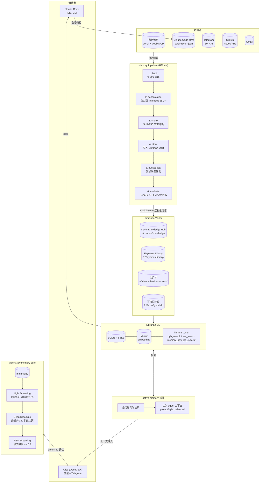
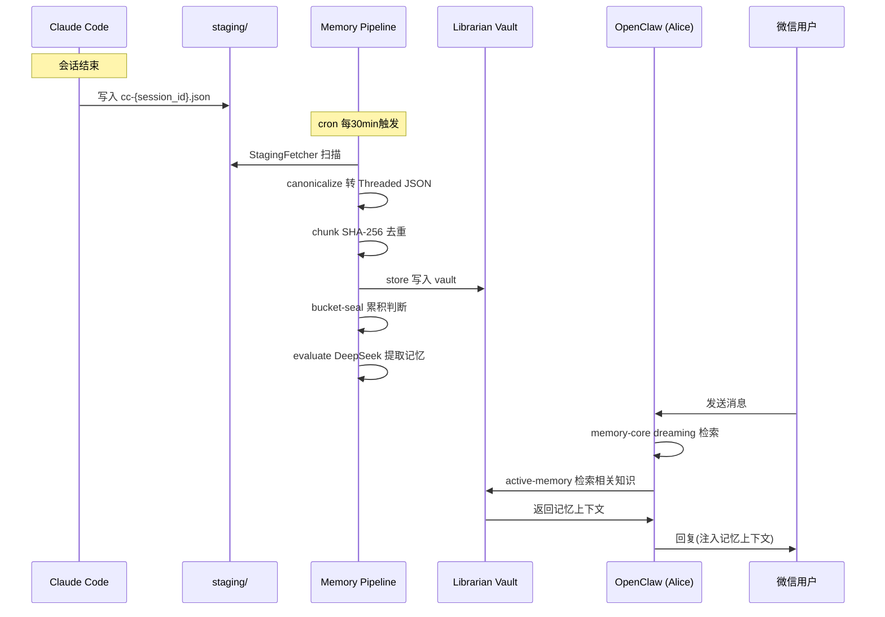
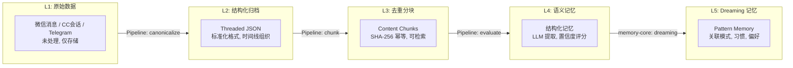

# Alice 记忆框架 (2026-05-22)

## 总览

## 数据流详解

## 记忆层级

## 关键参数

| 组件 | 参数 | 值 |
|------|------|-----|
| **Memory Pipeline** | 执行频率 | 每30分钟 (cron: `7,37 * * * *`) |
| | Bucket-Seal 触发阈值 | 10条消息 / 5000 tokens / 60分钟 |
| | 去重方式 | SHA-256 内容哈希 |
| | 状态数据库 | `~/.openclaw/memory-pipeline/db/state.sqlite` |
| **memory-core Light** | 回溯天数 | 3天 |
| | 去重相似度阈值 | 0.85 |
| **memory-core Deep** | 最低评分 | 0.4 |
| | 记忆半衰期 | 10天 |
| **memory-core REM** | 模式强度阈值 | 0.7 |
| **active-memory** | 注入时机 | 每次会话启动 (contextInjection: always) |
| | promptStyle | balanced |
| | 适用会话类型 | direct + group |
| **Librarian** | 检索方式 | 混合检索 (关键词 FTS5 + 语义向量) |
| | Vault 数量 | 4个 |
